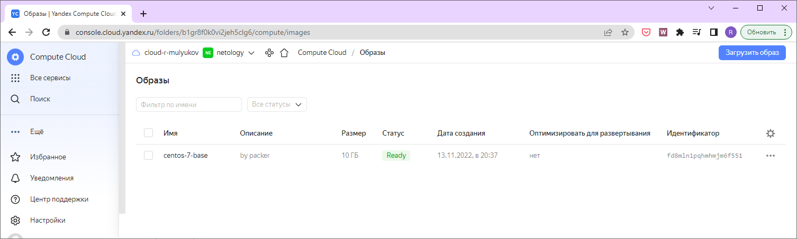
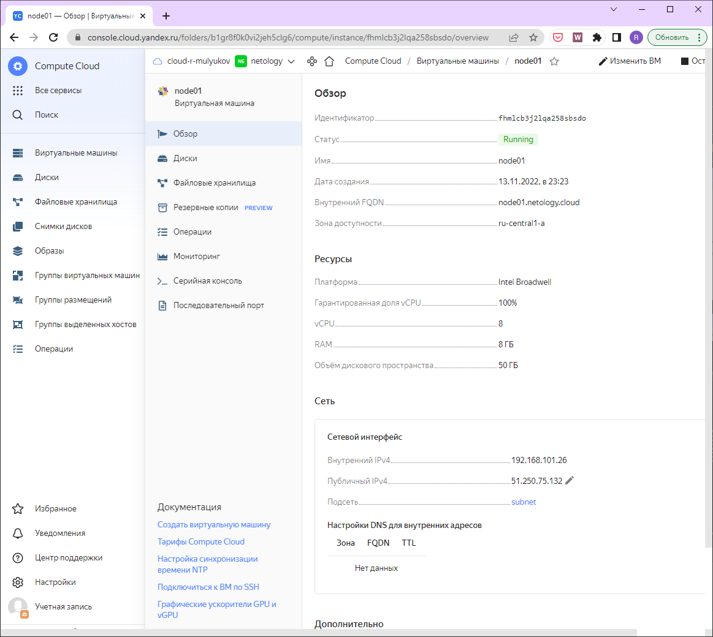
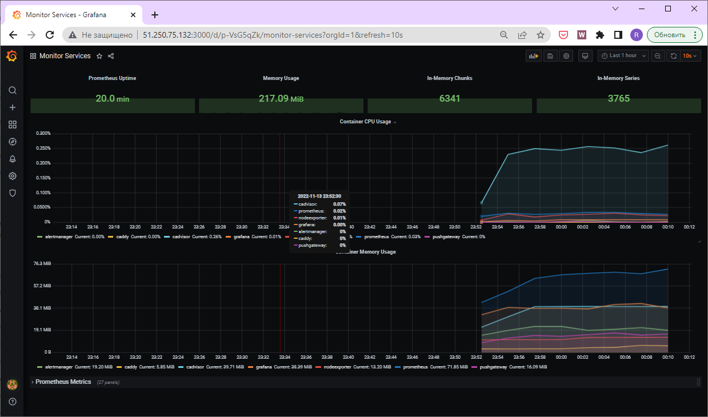

1.  
vagrant@server1:~$ yc compute image list  
+----------------------+---------------+--------+----------------------+--------+  
|          ID          |     NAME      | FAMILY |     PRODUCT IDS      | STATUS |  
+----------------------+---------------+--------+----------------------+--------+  
| fd8mln1pqhmhmjm6f551 | centos-7-base | centos | f2euv1kekdgvc0jrpaet | READY  |  
+----------------------+---------------+--------+----------------------+--------+  
  
2.  

3.   
