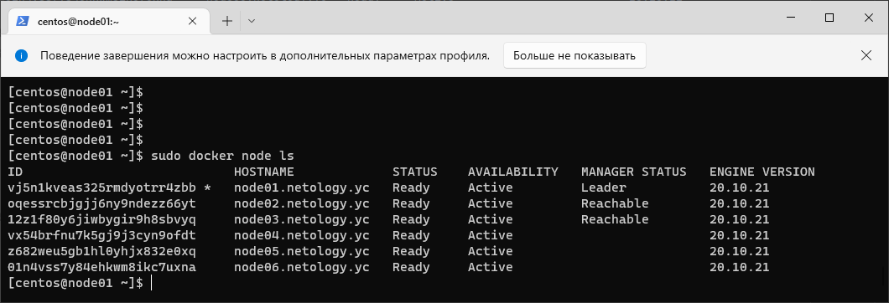
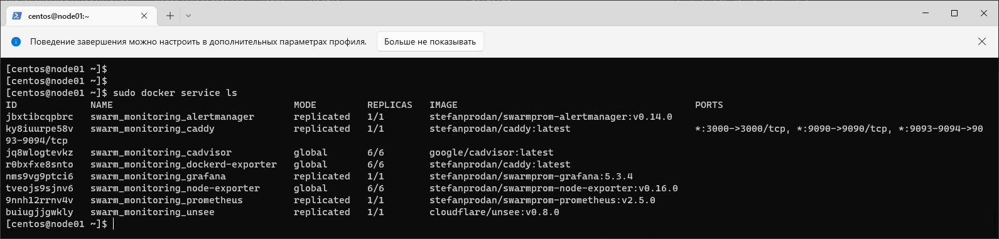
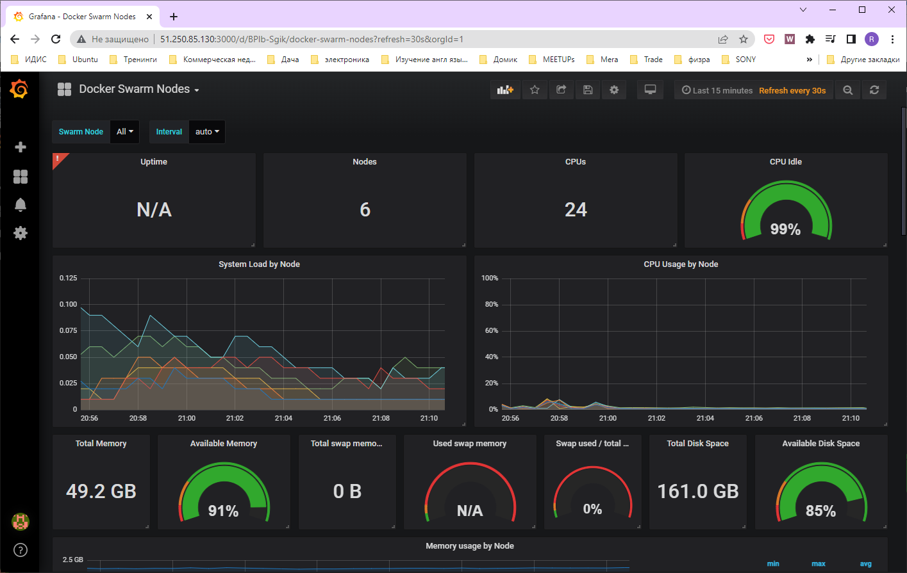
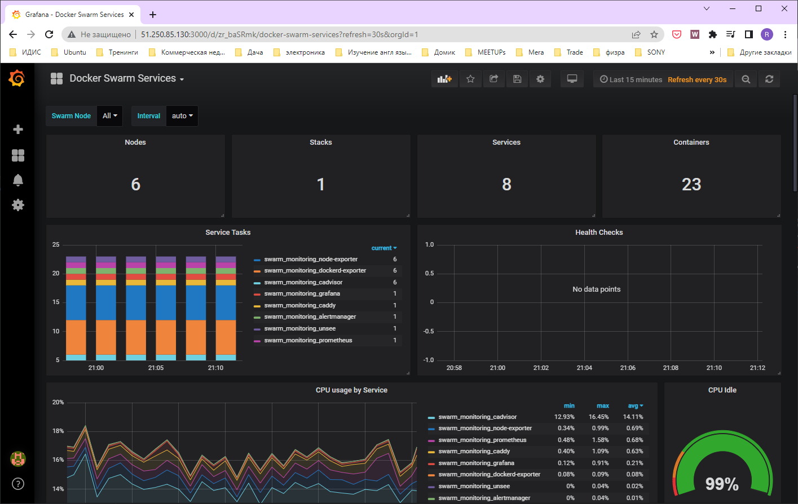

1.  
в Docker Swarm кластере replication указываем количество идентичых задач которые хотим запустить и   
global запускает одну задачу на каждой ноде, при добавлении нод, сервис будет запущен автоматически  
выбор лидера в Docker Swarm кластере осуществляется с помощью алгоритма поддержания распределенного консенсуса Raft   
Overlay Network  это сеть между контейнерами и сервисами docker, позволяет контейнерам безопасно обмениваться данными
2.
  
[centos@node01 ~]$ sudo docker node ls  
ID                            HOSTNAME             STATUS    AVAILABILITY   MANAGER STATUS   ENGINE VERSION  
vj5n1kveas325rmdyotrr4zbb *   node01.netology.yc   Ready     Active         Leader           20.10.21  
oqessrcbjgjj6ny9ndezz66yt     node02.netology.yc   Ready     Active         Reachable        20.10.21  
12z1f80y6jiwbygir9h8sbvyq     node03.netology.yc   Ready     Active         Reachable        20.10.21  
vx54brfnu7k5gj9j3cyn9ofdt     node04.netology.yc   Ready     Active                          20.10.21  
z682weu5gb1hl0yhjx832e0xq     node05.netology.yc   Ready     Active                          20.10.21  
01n4vss7y84ehkwm8ikc7uxna     node06.netology.yc   Ready     Active                          20.10.21  

3.  

[centos@node01 ~]$ sudo docker service ls  
ID             NAME                                MODE         REPLICAS   IMAGE                                          PORTSjbxtibcqpbrc   swarm_monitoring_alertmanager       replicated   1/1        stefanprodan/swarmprom-alertmanager:v0.14.0
ky8iuurpe58v   swarm_monitoring_caddy              replicated   1/1        stefanprodan/caddy:latest                      *:3000->3000/tcp, *:9090->9090/tcp, *:9093-9094->9093-9094/tcp  
jq8wlogtevkz   swarm_monitoring_cadvisor           global       6/6        google/cadvisor:latest  
r0bxfxe8snto   swarm_monitoring_dockerd-exporter   global       6/6        stefanprodan/caddy:latest  
nms9vg9ptci6   swarm_monitoring_grafana            replicated   1/1        stefanprodan/swarmprom-grafana:5.3.4  
tveojs9sjnv6   swarm_monitoring_node-exporter      global       6/6        stefanprodan/swarmprom-node-exporter:v0.16.0  
9nnh12rrnv4v   swarm_monitoring_prometheus         replicated   1/1        stefanprodan/swarmprom-prometheus:v2.5.0  
buiugjjgwkly   swarm_monitoring_unsee              replicated   1/1        cloudflare/unsee:v0.8.0    
  

  
