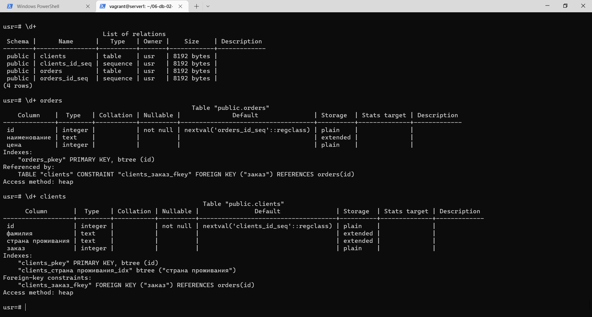
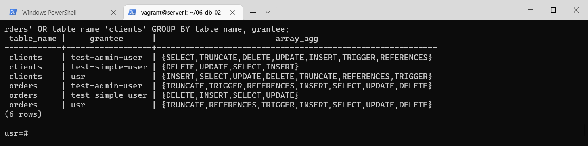
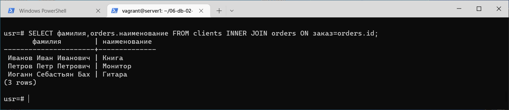
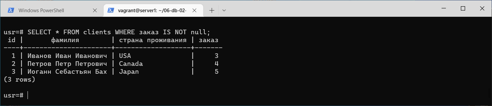
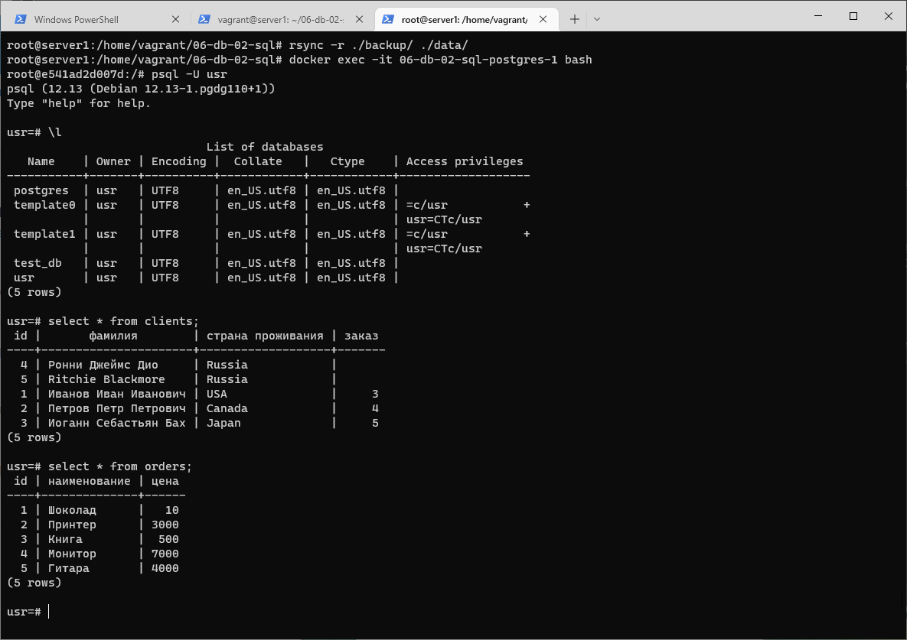

1.
vagrant@server1:~/06-db-02-sql$ sudo docker-compose ps  
NAME                      COMMAND                  SERVICE             STATUS              PORTS  
06-db-02-sql-postgres-1   "docker-entrypoint.s…"   postgres            running             0.0.0.0:5432->5432/tcp, :::5432->5432/tcp  

vagrant@server1:~/06-db-02-sql$ cat docker-compose.yaml  
version: '3.1'  
services:  
  postgres:  
    image: postgres:12  
    environment:  
      - POSTGRES_PASSWORD=usr  
      - POSTGRES_USER=usr  
    volumes:  
      - ./data:/var/lib/postgresql/data  
      - ./backup:/data/backup/postgres  
    ports:  
      - "5432:5432"  
    restart: always

2. 
usr=# CREATE USER "test-admin-user";  
CREATE ROLE  

usr=# CREATE DATABASE test_db;  
CREATE DATABASE  

usr=# CREATE DATABASE test_db;
CREATE DATABASE  
  
usr=# CREATE TABLE orders (  
usr(# id SERIAL PRIMARY KEY,  
usr(# наименование TEXT,  
usr(# цена INT  
usr(# );  
CREATE TABLE    

usr=# CREATE TABLE clients (  
usr(# id SERIAL PRIMARY KEY,  
usr(# фамилия TEXT,  
usr(# "страна проживания" TEXT,  
usr(# заказ INT REFERENCES orders(id)  
usr(# );  
CREATE TABLE  

usr=# CREATE INDEX ON clients ("страна проживания");  
CREATE INDEX  

usr=# GRANT ALL ON TABLE clients, orders TO "test-admin-user";  
GRANT  

usr=# CREATE USER "test-simple-user";  
CREATE ROLE  
  
usr=# GRANT SELECT,INSERT,UPDATE,DELETE ON TABLE clients,orders TO "test-simple-user";  
GRANT  

usr=# \l  
                             List of databases  
   Name    | Owner | Encoding |  Collate   |   Ctype    | Access privileges  
-----------+-------+----------+------------+------------+-------------------  
 postgres  | usr   | UTF8     | en_US.utf8 | en_US.utf8 |  
 template0 | usr   | UTF8     | en_US.utf8 | en_US.utf8 | =c/usr           +  
           |       |          |            |            | usr=CTc/usr  
 template1 | usr   | UTF8     | en_US.utf8 | en_US.utf8 | =c/usr           +  
           |       |          |            |            | usr=CTc/usr  
 test_db   | usr   | UTF8     | en_US.utf8 | en_US.utf8 |  
 usr       | usr   | UTF8     | en_US.utf8 | en_US.utf8 |  
(5 rows)  
usr=# \d+ orders  
                                                   Table "public.orders"  
    Column    |  Type   | Collation | Nullable |              Default               | Storage  | Stats target | Description  
--------------+---------+-----------+----------+------------------------------------+----------+--------------+-------------  
 id           | integer |           | not null | nextval('orders_id_seq'::regclass) | plain    |              |  
 наименование | text    |           |          |                                    | extended |              |  
 цена         | integer |           |          |                                    | plain    |              |  
Indexes:
    "orders_pkey" PRIMARY KEY, btree (id)  
Referenced by:  
    TABLE "clients" CONSTRAINT "clients_заказ_fkey" FOREIGN KEY ("заказ") REFERENCES orders(id)  
Access method: heap  

usr=# \d+ clients  
                                                      Table "public.clients"  
      Column       |  Type   | Collation | Nullable |               Default               | Storage  | Stats target | Description  
-------------------+---------+-----------+----------+-------------------------------------+----------+--------------+-------------  
 id                | integer |           | not null | nextval('clients_id_seq'::regclass) | plain    |              |  
 фамилия           | text    |           |          |                                     | extended |              |  
 страна проживания | text    |           |          |                                     | extended |              |  
 заказ             | integer |           |          |                                     | plain    |              |  
Indexes:  
    "clients_pkey" PRIMARY KEY, btree (id)  
    "clients_страна проживания_idx" btree ("страна проживания")  
Foreign-key constraints:  
    "clients_заказ_fkey" FOREIGN KEY ("заказ") REFERENCES orders(id)  
Access method: heap  
  

usr=# SELECT table_name, grantee, array_agg(privilege_type) FROM information_schema.table_privileges WHERE table_name='orders' OR table_name='clients' GROUP BY table_name, grantee;  
  

3.  
usr=# INSERT INTO orders (наименование, цена) VALUES ('Шоколад', '10'), ('Принтер', '3000'), ('Книга', '500'), ('Монитор', '7000'), ('Гитара', '4000');  
INSERT 0 5  
usr=# INSERT INTO clients ("фамилия", "страна проживания") VALUES  
usr-# ('Иванов Иван Иванович', 'USA'),  
usr-#  ('Петров Петр Петрович', 'Canada'),  
usr-# ('Иоганн Себастьян Бах', 'Japan'),  
usr-# ('Ронни Джеймс Дио', 'Russia'),  
usr-# ('Ritchie Blackmore', 'Russia');  
INSERT 0 5  
usr=# SELECT COUNT(*) FROM clients;  
 count  
-------  
     5  
(1 row)  

usr=# SELECT COUNT(*) FROM orders;  
 count  
-------  
     5  
(1 row)  
 
4.
usr=# UPDATE clients SET "заказ"=3 WHERE id=1;  
UPDATE 1  
usr=# UPDATE clients SET "заказ"=4 WHERE id=2;  
UPDATE 1  
usr=# UPDATE clients SET "заказ"=5 WHERE id=3;  
UPDATE 1  
usr=#  

usr=# SELECT фамилия,orders.наименование FROM clients INNER JOIN orders ON заказ=orders.id;  
       фамилия        | наименование  
----------------------+--------------  
 Иванов Иван Иванович | Книга  
 Петров Петр Петрович | Монитор  
 Иоганн Себастьян Бах | Гитара  
(3 rows)    
  

usr=# SELECT * FROM clients WHERE заказ IS NOT null;  
 id |       фамилия        | страна проживания | заказ  
----+----------------------+-------------------+-------  
  1 | Иванов Иван Иванович | USA               |     3  
  2 | Петров Петр Петрович | Canada            |     4  
  3 | Иоганн Себастьян Бах | Japan             |     5  
(3 rows)  
  

5.  
usr=# EXPLAIN SELECT * FROM clients WHERE заказ IS NOT null;  
                        QUERY PLAN  
-----------------------------------------------------------  
 Seq Scan on clients  (cost=0.00..18.10 rows=806 width=72)  
   Filter: ("заказ" IS NOT NULL)  
(2 rows)
- Приблизительная стоимость запуска (0.00). Это время, которое проходит, прежде чем начнётся этап вывода данных.  
- Приблизительная общая стоимость (18.10). Вычисляется как (число_чтений_диска * seq_page_cost) + (число_просканированных_строк * cpu_tuple_cost).  
- Ожидаемое число строк, которое должен вывести этот узел плана (806).  
- Ожидаемый средний размер строк (72) 
- Используется фильтр  

  
6.   
бекап с помощью файловой системы, стоп сервера БД  
postgres@e541ad2d007d:/$ pg_ctl stop  
waiting for server to shut down....vagrant@server1:~/06-db-02-sql$  

копируем разделы  
root@server1:/home/vagrant/06-db-02-sql# rsync -r ./data/ ./backup/  

останов контейнера  
root@server1:/home/vagrant/06-db-02-sql# docker ps  
CONTAINER ID   IMAGE         COMMAND                  CREATED        STATUS         PORTS                                       NAMES  
e541ad2d007d   postgres:12   "docker-entrypoint.s…"   15 hours ago   Up 7 minutes   0.0.0.0:5432->5432/tcp, :::5432->5432/tcp   06-db-02-sql-postgres-1  
root@server1:/home/vagrant/06-db-02-sql# docker stop e541ad2d007d  
e541ad2d007d    

удалим данные БД контейнера  
root@server1:/home/vagrant/06-db-02-sql# cd data  
root@server1:/home/vagrant/06-db-02-sql/data# rm -r *  
root@server1:/home/vagrant/06-db-02-sql/data# ll  
total 8  
drwx------ 2 systemd-coredump root    4096 Nov 29 06:18 ./  
drwxrwxr-x 4 vagrant          vagrant 4096 Nov 28 15:13 ../  

пустая БД  
root@server1:/home/vagrant/06-db-02-sql# docker-compose up -d  
[+] Running 1/1  
 ⠿ Container 06-db-02-sql-postgres-1  Started  

убедимся что нет данных  
root@server1:/home/vagrant/06-db-02-sql# docker exec -it 06-db-02-sql-postgres-1 bash
root@e541ad2d007d:/# psql -U usr
psql (12.13 (Debian 12.13-1.pgdg110+1))
Type "help" for help.

usr=# \l  
                             List of databases  
   Name    | Owner | Encoding |  Collate   |   Ctype    | Access privileges  
-----------+-------+----------+------------+------------+-------------------  
 postgres  | usr   | UTF8     | en_US.utf8 | en_US.utf8 |  
 template0 | usr   | UTF8     | en_US.utf8 | en_US.utf8 | =c/usr           +  
           |       |          |            |            | usr=CTc/usr  
 template1 | usr   | UTF8     | en_US.utf8 | en_US.utf8 | =c/usr           +  
           |       |          |            |            | usr=CTc/usr  
 usr       | usr   | UTF8     | en_US.utf8 | en_US.utf8 |  
(4 rows)  
  
usr=#    

usr=# \q    
остановим БД  
  
root@e541ad2d007d:/# su postgres    
postgres@e541ad2d007d:/$ pg_ctl stop  
waiting for server to shut down....root@server1:/home/vagrant/06-db-02-sql#  

удалим содержимое     
root@server1:/home/vagrant/06-db-02-sql# rm -r ./data/*  
root@server1:/home/vagrant/06-db-02-sql# ll ./data  
total 8  
drwx------ 2 systemd-coredump root    4096 Nov 29 06:28 ./  
drwxrwxr-x 4 vagrant          vagrant 4096 Nov 29 06:26 ../  

скопируем из бекапа вместо пустого содержимого   
root@server1:/home/vagrant/06-db-02-sql# rsync -r ./backup/ ./data/  

подключимся и убедимся что все на месте  
  

