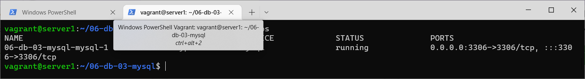
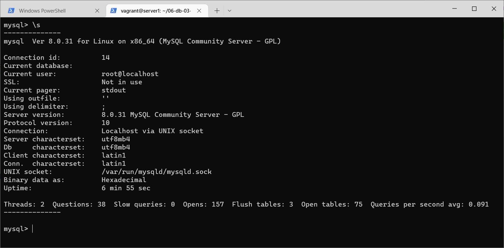
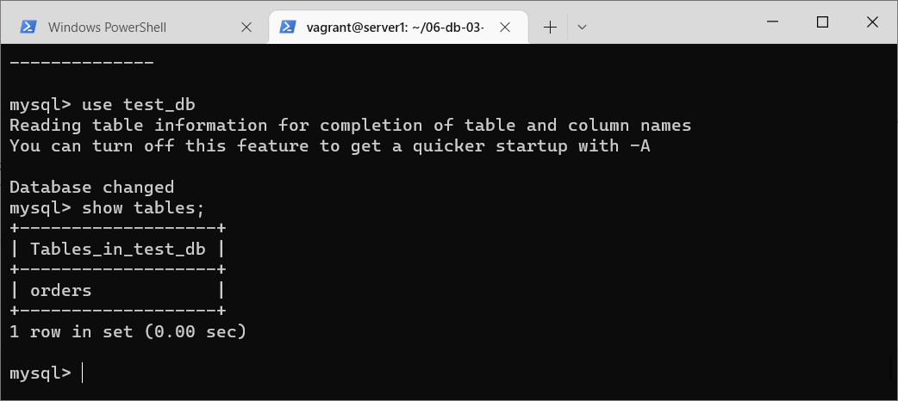
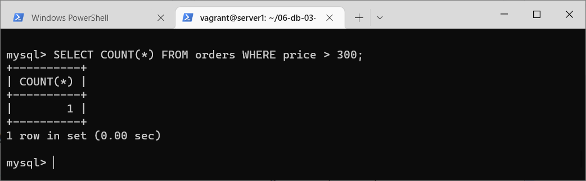
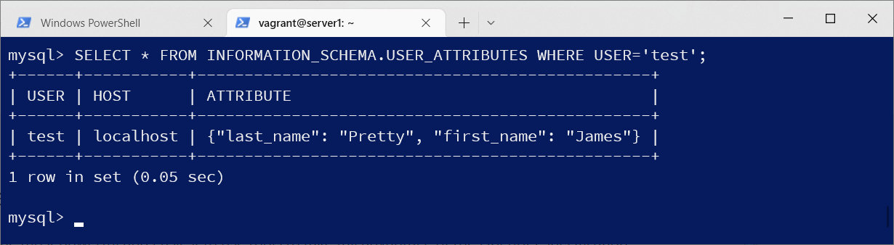
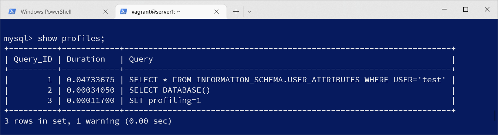
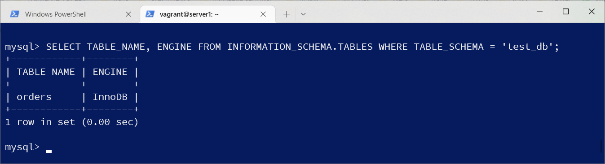
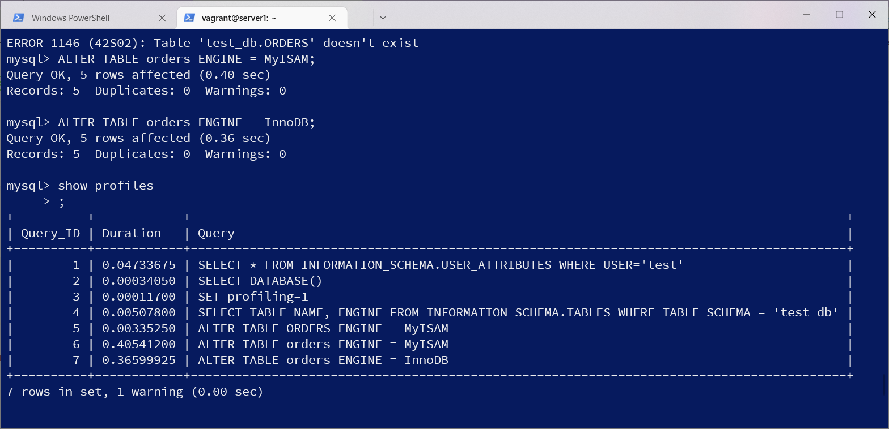

# Домашнее задание к занятию "6.3. MySQL"

## Введение

Перед выполнением задания вы можете ознакомиться с 
[дополнительными материалами](https://github.com/netology-code/virt-homeworks/blob/virt-11/additional/README.md).

## Задача 1

Используя docker поднимите инстанс MySQL (версию 8). Данные БД сохраните в volume.
vagrant@server1:~/06-db-03-mysql$ cat docker-compose.yaml  
version: '3.1'  
services:  
  mysql:  
    image: mysql:8  
    environment:  
      MYSQL_ROOT_PASSWORD: xx1  
      MYSQL_DATABASE: test_db  
    volumes:  
      - ./data:/var/lib/mysql  
      - ./backup:/data/backup/mysql  
    ports:  
      - "3306:3306"  
    restart: always  

Изучите [бэкап БД](https://github.com/netology-code/virt-homeworks/tree/virt-11/06-db-03-mysql/test_data) и 
восстановитесь из него.

Перейдите в управляющую консоль `mysql` внутри контейнера.

sudo docker exec -it 06-db-03-mysql-mysql-1 bash    
bash-4.4# mysql -u root -p  test_db < /data/backup/mysql/test_dump.sql  
Enter password:  

Используя команду `\h` получите список управляющих команд.

Найдите команду для выдачи статуса БД и **приведите в ответе** из ее вывода версию сервера БД.
  

Подключитесь к восстановленной БД и получите список таблиц из этой БД.

  

**Приведите в ответе** количество записей с `price` > 300.

  

В следующих заданиях мы будем продолжать работу с данным контейнером.

## Задача 2

Создайте пользователя test в БД c паролем test-pass, используя:
- плагин авторизации mysql_native_password
- срок истечения пароля - 180 дней 
- количество попыток авторизации - 3 
- максимальное количество запросов в час - 100
- аттрибуты пользователя:
    - Фамилия "Pretty"
    - Имя "James"
mysql> CREATE USER test@localhost  
    -> IDENTIFIED WITH mysql_native_password BY 'test-pass'  
    -> WITH MAX_QUERIES_PER_HOUR 100  
    -> PASSWORD EXPIRE INTERVAL 180 DAY  
    -> FAILED_LOGIN_ATTEMPTS 3  
    -> ATTRIBUTE '{"first_name": "James", "last_name": "Pretty"}';  
Query OK, 0 rows affected (0.11 sec)  
  
Предоставьте привелегии пользователю `test` на операции SELECT базы `test_db`.
mysql> GRANT SELECT ON test_db.* to test@localhost;  
Query OK, 0 rows affected, 1 warning (0.03 sec)  
    
Используя таблицу INFORMATION_SCHEMA.USER_ATTRIBUTES получите данные по пользователю `test` и 
**приведите в ответе к задаче**.
  

## Задача 3

Установите профилирование `SET profiling = 1`.
Изучите вывод профилирования команд `SHOW PROFILES;`.
  

Исследуйте, какой `engine` используется в таблице БД `test_db` и **приведите в ответе**.
  

Измените `engine` и **приведите время выполнения и запрос на изменения из профайлера в ответе**:
- на `MyISAM`
- на `InnoDB`
  

## Задача 4 

Изучите файл `my.cnf` в директории /etc/mysql.

Измените его согласно ТЗ (движок InnoDB):
- Скорость IO важнее сохранности данных
- Нужна компрессия таблиц для экономии места на диске
- Размер буффера с незакомиченными транзакциями 1 Мб
- Буффер кеширования 30% от ОЗУ
- Размер файла логов операций 100 Мб

Приведите в ответе измененный файл `my.cnf`.
vagrant@server1:~/06-db-03-mysql$ sudo docker exec -it 06-db-03-mysql-mysql-1 bash  
bash-4.4# cat /etc/my.cnf  
[mysqld]  
skip-host-cache  
skip-name-resolve  
datadir=/var/lib/mysql  
socket=/var/run/mysqld/mysqld.sock  
secure-file-priv=/var/lib/mysql-files  
user=mysql    
pid-file=/var/run/mysqld/mysqld.pid  
innodb_flush_method = O_DSYNC  
innodb_flush_log_at_trx_commit = 2  
innodb_file_per_table = 1  
innodb_log_buffer_size = 1M  
innodb_buffer_pool_size = 768M  
innodb_log_file_size = 100M  
  
[client]  
socket=/var/run/mysqld/mysqld.sock  
  
!includedir /etc/mysql/conf.d/  
---

### Как оформить ДЗ?

Выполненное домашнее задание пришлите ссылкой на .md-файл в вашем репозитории.

---