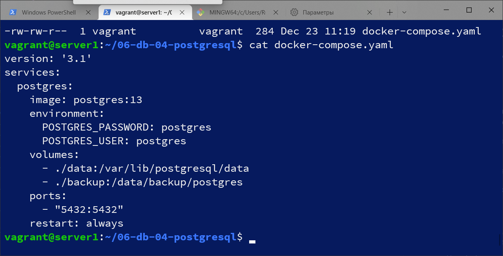

# Домашнее задание к занятию "6.4. PostgreSQL"

## Задача 1

Используя docker поднимите инстанс PostgreSQL (версию 13). Данные БД сохраните в volume.

Подключитесь к БД PostgreSQL используя `psql`.

Воспользуйтесь командой `\?` для вывода подсказки по имеющимся в `psql` управляющим командам.

**Найдите и приведите** управляющие команды для:
- вывода списка БД
postgres=# \l  
                                 List of databases  
   Name    |  Owner   | Encoding |  Collate   |   Ctype    |   Access privileges  
-----------+----------+----------+------------+------------+-----------------------  
 postgres  | postgres | UTF8     | en_US.utf8 | en_US.utf8 |  
 template0 | postgres | UTF8     | en_US.utf8 | en_US.utf8 | =c/postgres          +  
           |          |          |            |            | postgres=CTc/postgres  
 template1 | postgres | UTF8     | en_US.utf8 | en_US.utf8 | =c/postgres          +  
           |          |          |            |            | postgres=CTc/postgres  
(3 rows)  
- подключения к БД
postgres=# \c postgres  
You are now connected to database "postgres" as user "postgres".  
- вывода списка таблиц
postgres=# \dt  
Did not find any relations.  
- вывода описания содержимого таблиц
postgres-# \d pg_am  
               Table "pg_catalog.pg_am"  
  Column   |  Type   | Collation | Nullable | Default  
-----------+---------+-----------+----------+---------  
 oid       | oid     |           | not null |  
 amname    | name    |           | not null |  
 amhandler | regproc |           | not null |  
 amtype    | "char"  |           | not null |  
Indexes:  
    "pg_am_name_index" UNIQUE, btree (amname)  
    "pg_am_oid_index" UNIQUE, btree (oid)  
- выхода из psql
postgres-# \q  
root@ec4ae267df3f:/#  
  
## Задача 2

Используя `psql` создайте БД `test_database`.

Изучите [бэкап БД](https://github.com/netology-code/virt-homeworks/tree/virt-11/06-db-04-postgresql/test_data).

Восстановите бэкап БД в `test_database`.

Перейдите в управляющую консоль `psql` внутри контейнера.

Подключитесь к восстановленной БД и проведите операцию ANALYZE для сбора статистики по таблице.

Используя таблицу [pg_stats](https://postgrespro.ru/docs/postgresql/12/view-pg-stats), найдите столбец таблицы `orders` 
с наибольшим средним значением размера элементов в байтах.

**Приведите в ответе** команду, которую вы использовали для вычисления и полученный результат.

## Задача 3

Архитектор и администратор БД выяснили, что ваша таблица orders разрослась до невиданных размеров и
поиск по ней занимает долгое время. Вам, как успешному выпускнику курсов DevOps в нетологии предложили
провести разбиение таблицы на 2 (шардировать на orders_1 - price>499 и orders_2 - price<=499).

Предложите SQL-транзакцию для проведения данной операции.

Можно ли было изначально исключить "ручное" разбиение при проектировании таблицы orders?

## Задача 4

Используя утилиту `pg_dump` создайте бекап БД `test_database`.

Как бы вы доработали бэкап-файл, чтобы добавить уникальность значения столбца `title` для таблиц `test_database`?

---

### Как cдавать задание

Выполненное домашнее задание пришлите ссылкой на .md-файл в вашем репозитории.

---