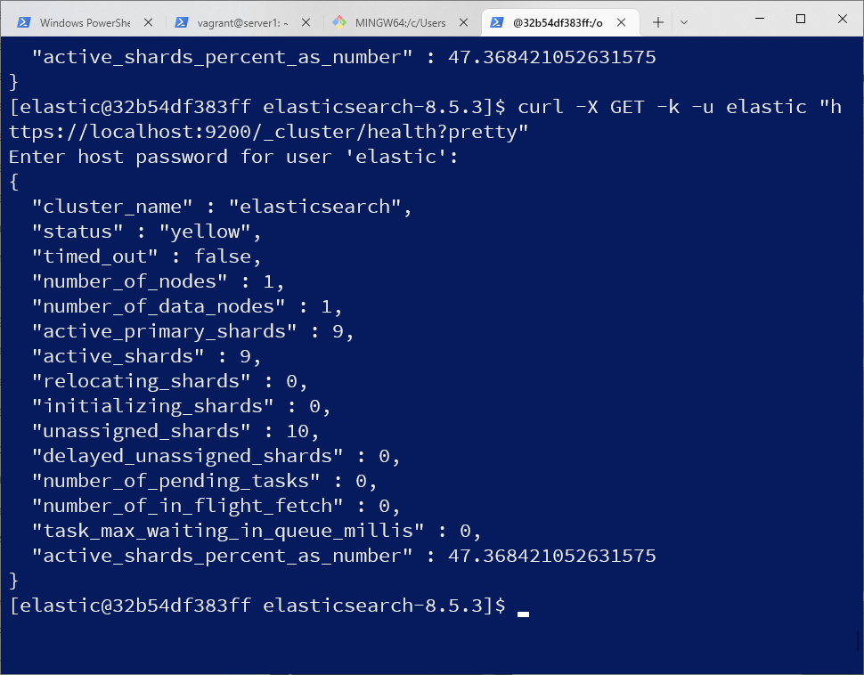
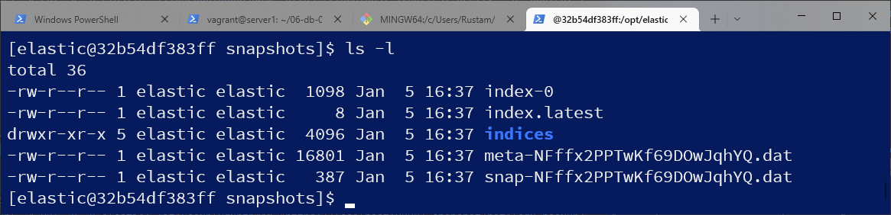

# Домашнее задание к занятию "6.5. Elasticsearch"

## Задача 1

В этом задании вы потренируетесь в:
- установке elasticsearch
- первоначальном конфигурировании elastcisearch
- запуске elasticsearch в docker

Используя докер образ [centos:7](https://hub.docker.com/_/centos) как базовый и 
[документацию по установке и запуску Elastcisearch](https://www.elastic.co/guide/en/elasticsearch/reference/current/targz.html):

- составьте Dockerfile-манифест для elasticsearch  
- соберите docker-образ и сделайте `push` в ваш docker.io репозиторий
- запустите контейнер из получившегося образа и выполните запрос пути `/` c хост-машины  
  
Требования к `elasticsearch.yml`:
- данные `path` должны сохраняться в `/var/lib`
- имя ноды должно быть `netology_test`
node.name: netology_test  
path.data: /var/lib/data  
xpack.ml.enabled: false  
В ответе приведите:
- текст Dockerfile манифеста 
elastic вначале скачал на локальный диск через впн,   
wget https://artifacts.elastic.co/downloads/elasticsearch/elasticsearch-8.5.3-linux-x86_64.tar.gz  
wget https://artifacts.elastic.co/downloads/elasticsearch/elasticsearch-8.5.3-linux-x86_64.tar.gz.sha512   

затем уже устанавливал с локального диска  

FROM centos:7  
COPY elasticsearch-8.5.3-linux-x86_64.tar.gz /opt  
COPY elasticsearch-8.5.3-linux-x86_64.tar.gz.sha512 /opt  
RUN groupadd elastic && useradd -g elastic elastic && \  
    cd /opt && yum update -y && yum -y install wget perl-Digest-SHA && \  
    shasum -a 512 -c elasticsearch-8.5.3-linux-x86_64.tar.gz.sha512 && \  
    tar -xzf elasticsearch-8.5.3-linux-x86_64.tar.gz && \  
    rm elasticsearch-8.5.3-linux-x86_64.tar.gz && \  
    rm elasticsearch-8.5.3-linux-x86_64.tar.gz.sha512 && \  
    mkdir /var/lib/data && chmod -R 777 /var/lib/data && \  
    chown -R elastic:elastic /opt/elasticsearch-8.5.3 && \  
    yum clean all  
USER elastic  
WORKDIR /opt/elasticsearch-8.5.3/  
COPY elasticsearch.yml  config/  
EXPOSE 9200 9300  
ENTRYPOINT ["bin/elasticsearch"]  

- ссылку на образ в репозитории dockerhub  
https://hub.docker.com/repository/docker/rmulyukov/elastic  

- ответ `elasticsearch` на запрос пути `/` в json виде  
[elastic@32b54df383ff elasticsearch-8.5.3]$ curl -k -u elastic https://localhost:9200  
Enter host password for user 'elastic':  
{  
  "name" : "netology_test",  
  "cluster_name" : "elasticsearch",  
  "cluster_uuid" : "p38ShQdtTK2Cqm4C09tkGQ",  
  "version" : {  
    "number" : "8.5.3",  
    "build_flavor" : "default",  
    "build_type" : "tar",  
    "build_hash" : "4ed5ee9afac63de92ec98f404ccbed7d3ba9584e",  
    "build_date" : "2022-12-05T18:22:22.226119656Z",  
    "build_snapshot" : false,  
    "lucene_version" : "9.4.2",  
    "minimum_wire_compatibility_version" : "7.17.0",  
    "minimum_index_compatibility_version" : "7.0.0"  
  },  
  "tagline" : "You Know, for Search"  
}  

Подсказки:
- возможно вам понадобится установка пакета perl-Digest-SHA для корректной работы пакета shasum
- при сетевых проблемах внимательно изучите кластерные и сетевые настройки в elasticsearch.yml
- при некоторых проблемах вам поможет docker директива ulimit
- elasticsearch в логах обычно описывает проблему и пути ее решения

Далее мы будем работать с данным экземпляром elasticsearch.

## Задача 2

В этом задании вы научитесь:
- создавать и удалять индексы
- изучать состояние кластера
- обосновывать причину деградации доступности данных

Ознакомтесь с [документацией](https://www.elastic.co/guide/en/elasticsearch/reference/current/indices-create-index.html) 
и добавьте в `elasticsearch` 3 индекса, в соответствии со таблицей:

| Имя | Количество реплик | Количество шард |
|-----|-------------------|-----------------|
| ind-1| 0 | 1 |
| ind-2 | 1 | 2 |
| ind-3 | 2 | 4 |
curl -X PUT -k -u elastic "https://localhost:9200/ind-1?pretty" -H 'Content-Type: application/json' -d'  
{  
  "settings": {  
    "number_of_shards": 1,  
    "number_of_replicas": 0  
  }  
}  
'  
curl -X PUT -k -u elastic "https://localhost:9200/ind-2?pretty" -H 'Content-Type: application/json' -d'  
{  
  "settings": {  
    "number_of_shards": 2,  
    "number_of_replicas": 1  
  }  
}  
'
curl -X PUT -k -u elastic "https://localhost:9200/ind-3?pretty" -H 'Content-Type: application/json' -d'  
{  
  "settings": {  
    "number_of_shards": 4,  
    "number_of_replicas": 2  
  }  
}  
'

Получите список индексов и их статусов, используя API и **приведите в ответе** на задание.  
curl -X GET -k -u elastic "https://localhost:9200/_cat/indices?v=true"   

Получите состояние кластера `elasticsearch`, используя API.  

curl -X GET -k -u elastic "https://localhost:9200/_cluster/health?pretty"  

Как вы думаете, почему часть индексов и кластер находится в состоянии yellow?  
у нас 1 нода, а реплик 1 и более, т.е. индексы по факту не имеют реплик на других нодах  

Удалите все индексы.  
curl -X DELETE -k -u elastic:=IitASeoOpl0gDbznWcm "https://localhost:9200/ind-1?pretty"  
curl -X DELETE -k -u elastic:=IitASeoOpl0gDbznWcm "https://localhost:9200/ind-2?pretty"  
curl -X DELETE -k -u elastic:=IitASeoOpl0gDbznWcm "https://localhost:9200/ind-3?pretty"  
**Важно**

При проектировании кластера elasticsearch нужно корректно рассчитывать количество реплик и шард,
иначе возможна потеря данных индексов, вплоть до полной, при деградации системы.

## Задача 3

В данном задании вы научитесь:
- создавать бэкапы данных
- восстанавливать индексы из бэкапов

Создайте директорию `{путь до корневой директории с elasticsearch в образе}/snapshots`.

Используя API [зарегистрируйте](https://www.elastic.co/guide/en/elasticsearch/reference/current/snapshots-register-repository.html#snapshots-register-repository) 
данную директорию как `snapshot repository` c именем `netology_backup`.

**Приведите в ответе** запрос API и результат вызова API для создания репозитория.

curl -X PUT -k -u elastic:=IitASeoOpl0gDbznWcm "https://localhost:9200/_snapshot/netology_backup?pretty" -H 'Content-Type: application/json' -d'  
{  
  "type": "fs",  
  "settings": {  
    "location": "/opt/elasticsearch-8.5.3/snapshots"  
  }  
}  
'  

Создайте индекс `test` с 0 реплик и 1 шардом и **приведите в ответе** список индексов.
curl -X PUT -k -u elastic:=IitASeoOpl0gDbznWcm "https://localhost:9200/test?pretty" -H 'Content-Type: application/json' -d'    
{    
  "settings": {  
    "number_of_shards": 1,  
    "number_of_replicas": 0
  }  
}  
'  
curl -X GET -k -u elastic:=IitASeoOpl0gDbznWcm "https://localhost:9200/_cat/indices?v=true"  
 
  
[Создайте `snapshot`](https://www.elastic.co/guide/en/elasticsearch/reference/current/snapshots-take-snapshot.html) 
состояния кластера `elasticsearch`.
curl -X PUT -k -u elastic:=IitASeoOpl0gDbznWcm "https://localhost:9200/_snapshot/netology_backup/snapshot_test?pretty"  

**Приведите в ответе** список файлов в директории со `snapshot`ами.

Удалите индекс `test` и создайте индекс `test-2`. **Приведите в ответе** список индексов.

[Восстановите](https://www.elastic.co/guide/en/elasticsearch/reference/current/snapshots-restore-snapshot.html) состояние
кластера `elasticsearch` из `snapshot`, созданного ранее.   
список  
curl -X GET -k -u elastic:=IitASeoOpl0gDbznWcm "https://localhost:9200/_snapshot/netology_backup/*?verbose=false&pretty"     

**Приведите в ответе** запрос к API восстановления и итоговый список индексов.  
curl -X POST -k -u elastic:=IitASeoOpl0gDbznWcm "https://localhost:9200/_snapshot/netology_backup/snapshot_test/_restore?pretty" -H 'Content-Type: application/json' -d'  
{  
  "indices": "*",  
  "include_global_state": true  
}  
'  
  
  

Подсказки:
- возможно вам понадобится доработать `elasticsearch.yml` в части директивы `path.repo` и перезапустить `elasticsearch`

---

### Как cдавать задание

Выполненное домашнее задание пришлите ссылкой на .md-файл в вашем репозитории.

---