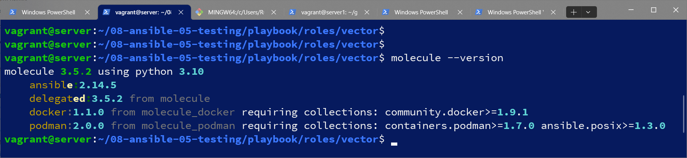
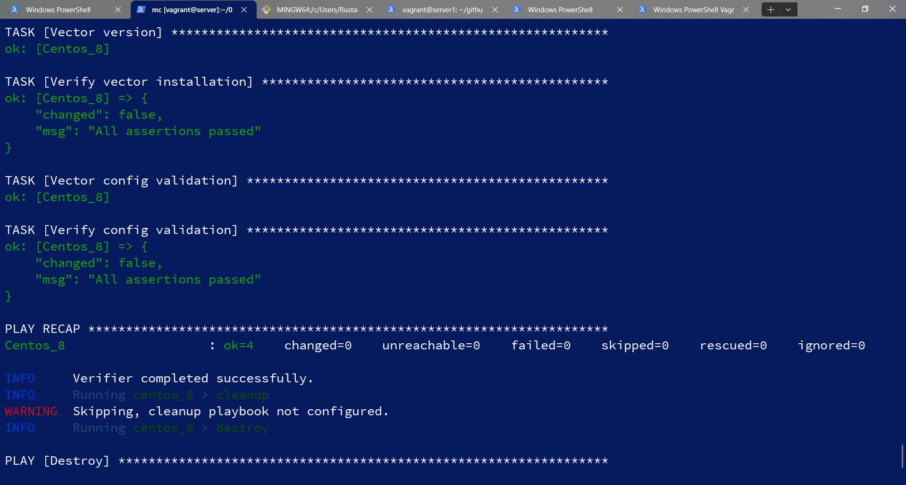
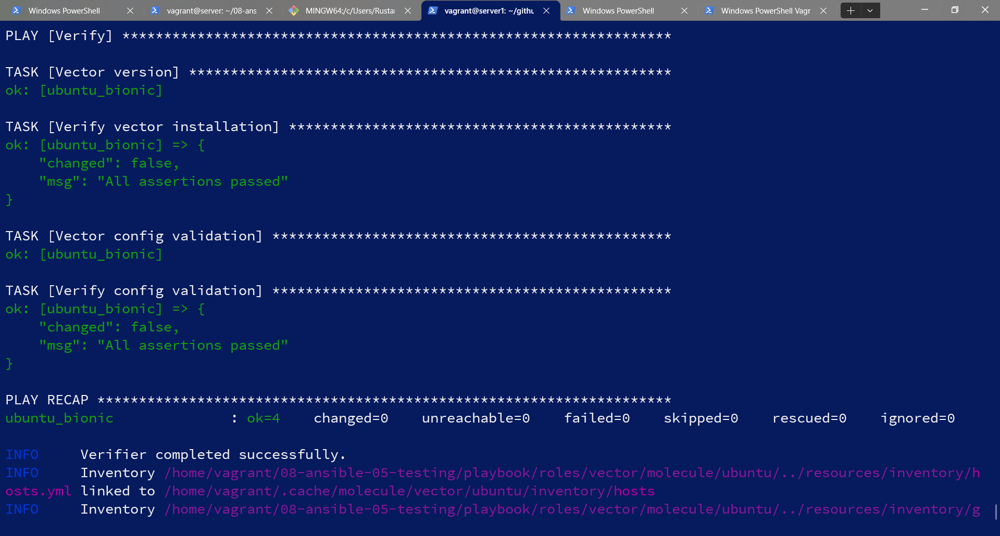
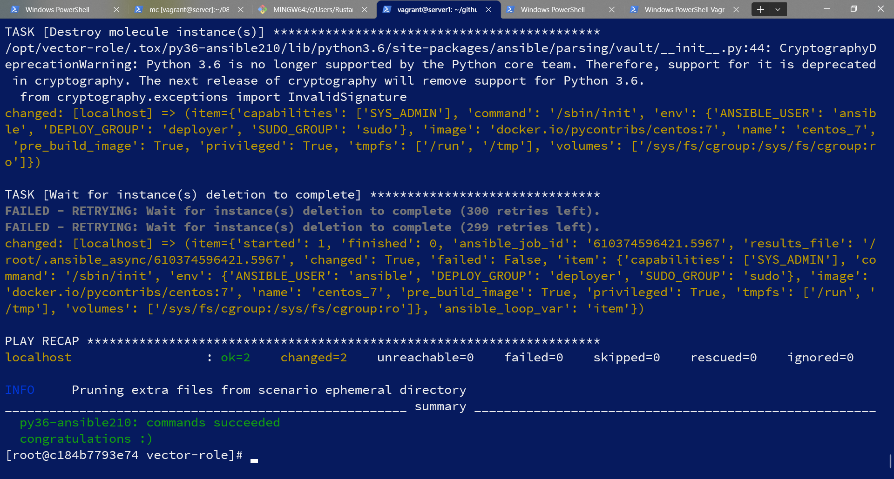

# Домашнее задание к занятию 5 «Тестирование roles»

## Подготовка к выполнению

1. Установите molecule: `pip3 install "molecule==3.5.2"`.
2. Выполните `docker pull aragast/netology:latest` —  это образ с podman, tox и несколькими пайтонами (3.7 и 3.9) внутри.

## Основная часть

Ваша цель — настроить тестирование ваших ролей. 

Задача — сделать сценарии тестирования для vector. 

Ожидаемый результат — все сценарии успешно проходят тестирование ролей.

### Molecule

1. Запустите  `molecule test -s centos_7` внутри корневой директории clickhouse-role, посмотрите на вывод команды. Данная команда может отработать с ошибками, это нормально. Наша цель - посмотреть как другие в реальном мире используют молекулу.
2. Перейдите в каталог с ролью vector-role и создайте сценарий тестирования по умолчанию при помощи `molecule init scenario --driver-name docker`.
3. Добавьте несколько разных дистрибутивов (centos:8, ubuntu:latest) для инстансов и протестируйте роль, исправьте найденные ошибки, если они есть.
4. Добавьте несколько assert в verify.yml-файл для  проверки работоспособности vector-role (проверка, что конфиг валидный, проверка успешности запуска и др.). 
5. Запустите тестирование роли повторно и проверьте, что оно прошло успешно.
5. Добавьте новый тег на коммит с рабочим сценарием в соответствии с семантическим версионированием.


  [версия 2.0.1](https://github.com/UstasNest/vector-role/tree/2.0.1)   

### Tox

1. Добавьте в директорию с vector-role файлы из [директории](./example).
2. Запустите `docker run --privileged=True -v <path_to_repo>:/opt/vector-role -w /opt/vector-role -it aragast/netology:latest /bin/bash`, где path_to_repo — путь до корня репозитория с vector-role на вашей файловой системе.
3. Внутри контейнера выполните команду `tox`, посмотрите на вывод.
5. Создайте облегчённый сценарий для `molecule` с драйвером `molecule_podman`. Проверьте его на исполнимость.
6. Пропишите правильную команду в `tox.ini`, чтобы запускался облегчённый сценарий.
8. Запустите команду `tox`. Убедитесь, что всё отработало успешно.
9. Добавьте новый тег на коммит с рабочим сценарием в соответствии с семантическим версионированием.
  
  [версия 3.0.0](https://github.com/UstasNest/vector-role/tree/3.0.0)
```commandline
tox
py36-ansible210 installed: ansible==2.10.7,ansible-base==2.10.17,ansible-compat==1.0.0,ansible-lint==5.4.0,arrow==1.2.3,bcrypt==4.0.1,binaryornot==0.4.4,bracex==2.2.1,cached-property==1.5.2,Cerberus==1.3.2,certifi==2023.5.7,cffi==1.15.1,chardet==5.0.0,charset-normalizer==2.0.12,click==8.0.4,click-help-colors==0.9.1,commonmark==0.9.1,cookiecutter==1.7.3,cryptography==40.0.2,dataclasses==0.8,distro==1.8.0,enrich==1.2.7,idna==3.4,importlib-metadata==4.8.3,Jinja2==3.0.3,jinja2-time==0.2.0,jmespath==0.10.0,lxml==4.9.2,MarkupSafe==2.0.1,molecule==3.5.2,molecule-podman==1.1.0,packaging==21.3,paramiko==2.12.0,pathspec==0.9.0,pluggy==1.0.0,poyo==0.5.0,pycparser==2.21,Pygments==2.14.0,PyNaCl==1.5.0,pyparsing==3.0.9,python-dateutil==2.8.2,python-slugify==6.1.2,PyYAML==5.4.1,requests==2.27.1,rich==12.6.0,ruamel.yaml==0.17.26,ruamel.yaml.clib==0.2.7,selinux==0.2.1,six==1.16.0,subprocess-tee==0.3.5,tenacity==8.2.2,text-unidecode==1.3,typing_extensions==4.1.1,urllib3==1.26.15,wcmatch==8.3,yamllint==1.28.0,zipp==3.6.0
py36-ansible210 run-test-pre: PYTHONHASHSEED='3930337500'
py36-ansible210 run-test: commands[0] | molecule test -s light --destroy always
/opt/vector-role/.tox/py36-ansible210/lib/python3.6/site-packages/requests/__init__.py:104: RequestsDependencyWarning: urllib3 (1.26.15) or chardet (5.0.0)/charset_normalizer (2.0.12) doesn't match a supported version!
  RequestsDependencyWarning)
/opt/vector-role/.tox/py36-ansible210/lib/python3.6/site-packages/ansible/parsing/vault/__init__.py:44: CryptographyDeprecationWarning: Python 3.6 is no longer supported by the Python core team. Therefore, support for it is deprecated in cryptography. The next release of cryptography will remove support for Python 3.6.
  from cryptography.exceptions import InvalidSignature
INFO     light scenario test matrix: destroy, create, converge, destroy
INFO     Performing prerun...
INFO     Set ANSIBLE_LIBRARY=/root/.cache/ansible-compat/b984a4/modules:/root/.ansible/plugins/modules:/usr/share/ansible/plugins/modules
INFO     Set ANSIBLE_COLLECTIONS_PATH=/root/.cache/ansible-compat/b984a4/collections:/root/.ansible/collections:/usr/share/ansible/collections
INFO     Set ANSIBLE_ROLES_PATH=/root/.cache/ansible-compat/b984a4/roles:/root/.ansible/roles:/usr/share/ansible/roles:/etc/ansible/roles
INFO     Running light > destroy
INFO     Sanity checks: 'podman'
/opt/vector-role/.tox/py36-ansible210/lib/python3.6/site-packages/ansible/parsing/vault/__init__.py:44: CryptographyDeprecationWarning: Python 3.6 is no longer supported by the Python core team. Therefore, support for it is deprecated in cryptography. The next release of cryptography will remove support for Python 3.6.
  from cryptography.exceptions import InvalidSignature

PLAY [Destroy] *****************************************************************

TASK [Destroy molecule instance(s)] ********************************************
/opt/vector-role/.tox/py36-ansible210/lib/python3.6/site-packages/ansible/parsing/vault/__init__.py:44: CryptographyDeprecationWarning: Python 3.6 is no longer supported by the Python core team. Therefore, support for it is deprecated in cryptography. The next release of cryptography will remove support for Python 3.6.
  from cryptography.exceptions import InvalidSignature
changed: [localhost] => (item={'capabilities': ['SYS_ADMIN'], 'command': '/sbin/init', 'env': {'ANSIBLE_USER': 'ansible', 'DEPLOY_GROUP': 'deployer', 'SUDO_GROUP': 'sudo'}, 'image': 'docker.io/pycontribs/centos:7', 'name': 'centos_7', 'pre_build_image': True, 'privileged': True, 'tmpfs': ['/run', '/tmp'], 'volumes': ['/sys/fs/cgroup:/sys/fs/cgroup:ro']})

TASK [Wait for instance(s) deletion to complete] *******************************
changed: [localhost] => (item={'started': 1, 'finished': 0, 'ansible_job_id': '909667275935.5342', 'results_file': '/root/.ansible_async/909667275935.5342', 'changed': True, 'failed': False, 'item': {'capabilities': ['SYS_ADMIN'], 'command': '/sbin/init', 'env': {'ANSIBLE_USER': 'ansible', 'DEPLOY_GROUP': 'deployer', 'SUDO_GROUP': 'sudo'}, 'image': 'docker.io/pycontribs/centos:7', 'name': 'centos_7', 'pre_build_image': True, 'privileged': True, 'tmpfs': ['/run', '/tmp'], 'volumes': ['/sys/fs/cgroup:/sys/fs/cgroup:ro']}, 'ansible_loop_var': 'item'})

PLAY RECAP *********************************************************************
localhost                  : ok=2    changed=2    unreachable=0    failed=0    skipped=0    rescued=0    ignored=0

INFO     Running light > create

PLAY [Create] ******************************************************************

TASK [get podman executable path] **********************************************
/opt/vector-role/.tox/py36-ansible210/lib/python3.6/site-packages/ansible/parsing/vault/__init__.py:44: CryptographyDeprecationWarning: Python 3.6 is no longer supported by the Python core team. Therefore, support for it is deprecated in cryptography. The next release of cryptography will remove support for Python 3.6.
  from cryptography.exceptions import InvalidSignature
ok: [localhost]

TASK [save path to executable as fact] *****************************************
ok: [localhost]

TASK [Log into a container registry] *******************************************
skipping: [localhost] => (item="centos_7 registry username: None specified")

TASK [Check presence of custom Dockerfiles] ************************************
ok: [localhost] => (item=Dockerfile: None specified)

TASK [Create Dockerfiles from image names] *************************************
skipping: [localhost] => (item="Dockerfile: None specified; Image: docker.io/pycontribs/centos:7")

TASK [Discover local Podman images] ********************************************
ok: [localhost] => (item=centos_7)

TASK [Build an Ansible compatible image] ***************************************
skipping: [localhost] => (item=docker.io/pycontribs/centos:7)

TASK [Determine the CMD directives] ********************************************
ok: [localhost] => (item="centos_7 command: /sbin/init")

TASK [Remove possible pre-existing containers] *********************************
changed: [localhost]

TASK [Discover local podman networks] ******************************************
skipping: [localhost] => (item=centos_7: None specified)

TASK [Create podman network dedicated to this scenario] ************************
skipping: [localhost]

TASK [Create molecule instance(s)] *********************************************
changed: [localhost] => (item=centos_7)

TASK [Wait for instance(s) creation to complete] *******************************
changed: [localhost] => (item=centos_7)

PLAY RECAP *********************************************************************
localhost                  : ok=8    changed=3    unreachable=0    failed=0    skipped=5    rescued=0    ignored=0

INFO     Running light > converge

PLAY [Converge] ****************************************************************

TASK [Gathering Facts] *********************************************************
/opt/vector-role/.tox/py36-ansible210/lib/python3.6/site-packages/ansible/parsing/vault/__init__.py:44: CryptographyDeprecationWarning: Python 3.6 is no longer supported by the Python core team. Therefore, support for it is deprecated in cryptography. The next release of cryptography will remove support for Python 3.6.
  from cryptography.exceptions import InvalidSignature
ok: [centos_7]

TASK [Copy something to test use of synchronize module] ************************
changed: [centos_7]

PLAY RECAP *********************************************************************
centos_7                   : ok=2    changed=1    unreachable=0    failed=0    skipped=0    rescued=0    ignored=0

INFO     Running light > destroy

PLAY [Destroy] *****************************************************************

TASK [Destroy molecule instance(s)] ********************************************
/opt/vector-role/.tox/py36-ansible210/lib/python3.6/site-packages/ansible/parsing/vault/__init__.py:44: CryptographyDeprecationWarning: Python 3.6 is no longer supported by the Python core team. Therefore, support for it is deprecated in cryptography. The next release of cryptography will remove support for Python 3.6.
  from cryptography.exceptions import InvalidSignature
changed: [localhost] => (item={'capabilities': ['SYS_ADMIN'], 'command': '/sbin/init', 'env': {'ANSIBLE_USER': 'ansible', 'DEPLOY_GROUP': 'deployer', 'SUDO_GROUP': 'sudo'}, 'image': 'docker.io/pycontribs/centos:7', 'name': 'centos_7', 'pre_build_image': True, 'privileged': True, 'tmpfs': ['/run', '/tmp'], 'volumes': ['/sys/fs/cgroup:/sys/fs/cgroup:ro']})

TASK [Wait for instance(s) deletion to complete] *******************************
FAILED - RETRYING: Wait for instance(s) deletion to complete (300 retries left).
FAILED - RETRYING: Wait for instance(s) deletion to complete (299 retries left).
changed: [localhost] => (item={'started': 1, 'finished': 0, 'ansible_job_id': '610374596421.5967', 'results_file': '/root/.ansible_async/610374596421.5967', 'changed': True, 'failed': False, 'item': {'capabilities': ['SYS_ADMIN'], 'command': '/sbin/init', 'env': {'ANSIBLE_USER': 'ansible', 'DEPLOY_GROUP': 'deployer', 'SUDO_GROUP': 'sudo'}, 'image': 'docker.io/pycontribs/centos:7', 'name': 'centos_7', 'pre_build_image': True, 'privileged': True, 'tmpfs': ['/run', '/tmp'], 'volumes': ['/sys/fs/cgroup:/sys/fs/cgroup:ro']}, 'ansible_loop_var': 'item'})

PLAY RECAP *********************************************************************
localhost                  : ok=2    changed=2    unreachable=0    failed=0    skipped=0    rescued=0    ignored=0

INFO     Pruning extra files from scenario ephemeral directory
______________________________________________________ summary ______________________________________________________
  py36-ansible210: commands succeeded
  congratulations :)
```
После выполнения у вас должно получится два сценария molecule и один tox.ini файл в репозитории. Не забудьте указать в ответе теги решений Tox и Molecule заданий. В качестве решения пришлите ссылку на  ваш репозиторий и скриншоты этапов выполнения задания. 

## Необязательная часть

1. Проделайте схожие манипуляции для создания роли LightHouse.
2. Создайте сценарий внутри любой из своих ролей, который умеет поднимать весь стек при помощи всех ролей.
3. Убедитесь в работоспособности своего стека. Создайте отдельный verify.yml, который будет проверять работоспособность интеграции всех инструментов между ними.
4. Выложите свои roles в репозитории.

В качестве решения пришлите ссылки и скриншоты этапов выполнения задания.

---

### Как оформить решение задания

Выполненное домашнее задание пришлите в виде ссылки на .md-файл в вашем репозитории.