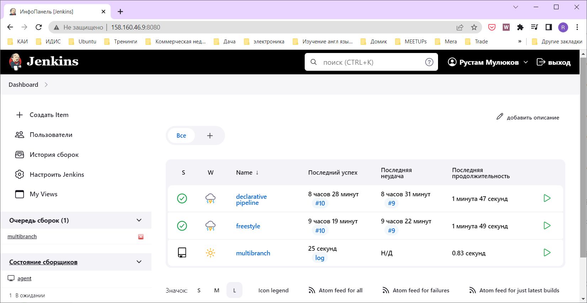
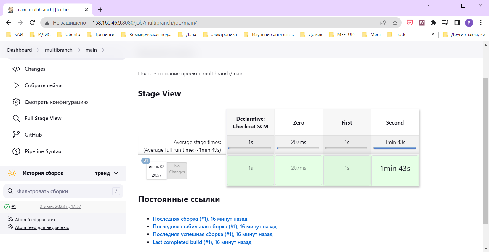

# Домашнее задание к занятию "10.Jenkins"

## Подготовка к выполнению

1. Создать 2 VM: для jenkins-master и jenkins-agent.
2. Установить jenkins при помощи playbook'a.
3. Запустить и проверить работоспособность.
4. Сделать первоначальную настройку.

## Основная часть

1. Сделать Freestyle Job, который будет запускать `molecule test` из любого вашего репозитория с ролью.
2. Сделать Declarative Pipeline Job, который будет запускать `molecule test` из любого вашего репозитория с ролью.

3. Перенести Declarative Pipeline в репозиторий в файл `Jenkinsfile`.
[Jenkinsfile](https://github.com/UstasNest/vector-role/blob/main/Jenkinsfile)
4. Создать Multibranch Pipeline на запуск `Jenkinsfile` из репозитория.

```
Branch indexing
17:57:20 Connecting to https://api.github.com with no credentials, anonymous access
Obtained Jenkinsfile from a4d40f18799403060d0605720a414be091327d47
[Pipeline] Start of Pipeline
[Pipeline] node
Running on agent in /opt/jenkins_agent/workspace/multibranch_main
[Pipeline] {
[Pipeline] stage
[Pipeline] { (Declarative: Checkout SCM)
[Pipeline] checkout
The recommended git tool is: NONE
No credentials specified
Cloning the remote Git repository
Cloning with configured refspecs honoured and without tags
Cloning repository https://github.com/UstasNest/vector-role.git
 > git init /opt/jenkins_agent/workspace/multibranch_main # timeout=10
Fetching upstream changes from https://github.com/UstasNest/vector-role.git
 > git --version # timeout=10
 > git --version # 'git version 1.8.3.1'
 > git fetch --no-tags --progress https://github.com/UstasNest/vector-role.git +refs/heads/main:refs/remotes/origin/main # timeout=10
Avoid second fetch
Checking out Revision a4d40f18799403060d0605720a414be091327d47 (main)
Commit message: "Jenkinsfile"
First time build. Skipping changelog.
 > git config remote.origin.url https://github.com/UstasNest/vector-role.git # timeout=10
 > git config --add remote.origin.fetch +refs/heads/main:refs/remotes/origin/main # timeout=10
 > git config core.sparsecheckout # timeout=10
 > git checkout -f a4d40f18799403060d0605720a414be091327d47 # timeout=10
[Pipeline] }
[Pipeline] // stage
[Pipeline] withEnv
[Pipeline] {
[Pipeline] stage
[Pipeline] { (Zero)
[Pipeline] cleanWs
[WS-CLEANUP] Deleting project workspace...
[WS-CLEANUP] Deferred wipeout is used...
[WS-CLEANUP] done
[Pipeline] }
[Pipeline] // stage
[Pipeline] stage
[Pipeline] { (First)
[Pipeline] sh
+ git clone https://github.com/UstasNest/vector-role.git
Cloning into 'vector-role'...
[Pipeline] }
[Pipeline] // stage
[Pipeline] stage
[Pipeline] { (Second)
[Pipeline] sh
+ cd vector-role
+ molecule test -s centos_7
INFO     centos_7 scenario test matrix: dependency, lint, cleanup, destroy, syntax, create, prepare, converge, idempotence, side_effect, verify, cleanup, destroy
INFO     Performing prerun...
INFO     Set ANSIBLE_LIBRARY=/home/jenkins/.cache/ansible-compat/f5bcd7/modules:/home/jenkins/.ansible/plugins/modules:/usr/share/ansible/plugins/modules
INFO     Set ANSIBLE_COLLECTIONS_PATH=/home/jenkins/.cache/ansible-compat/f5bcd7/collections:/home/jenkins/.ansible/collections:/usr/share/ansible/collections
INFO     Set ANSIBLE_ROLES_PATH=/home/jenkins/.cache/ansible-compat/f5bcd7/roles:/home/jenkins/.ansible/roles:/usr/share/ansible/roles:/etc/ansible/roles
INFO     Running centos_7 > dependency
WARNING  Skipping, missing the requirements file.
WARNING  Skipping, missing the requirements file.
INFO     Running centos_7 > lint
INFO     Lint is disabled.
INFO     Running centos_7 > cleanup
WARNING  Skipping, cleanup playbook not configured.
INFO     Running centos_7 > destroy
INFO     Sanity checks: 'docker'

PLAY [Destroy] *****************************************************************

TASK [Destroy molecule instance(s)] ********************************************
changed: [localhost] => (item=centos_7)

TASK [Wait for instance(s) deletion to complete] *******************************
FAILED - RETRYING: [localhost]: Wait for instance(s) deletion to complete (300 retries left).
ok: [localhost] => (item=centos_7)

TASK [Delete docker networks(s)] ***********************************************
skipping: [localhost]

PLAY RECAP *********************************************************************
localhost                  : ok=2    changed=1    unreachable=0    failed=0    skipped=1    rescued=0    ignored=0

INFO     Running centos_7 > syntax

playbook: /opt/jenkins_agent/workspace/multibranch_main/vector-role/molecule/centos_7/converge.yml
INFO     Running centos_7 > create

PLAY [Create] ******************************************************************

TASK [Log into a Docker registry] **********************************************
skipping: [localhost] => (item=None)
skipping: [localhost]

TASK [Check presence of custom Dockerfiles] ************************************
ok: [localhost] => (item={'capabilities': ['SYS_ADMIN'], 'command': '/sbin/init', 'env': {'ANSIBLE_USER': 'ansible', 'DEPLOY_GROUP': 'deployer', 'SUDO_GROUP': 'sudo'}, 'image': 'docker.io/pycontribs/centos:7', 'name': 'centos_7', 'pre_build_image': True, 'privileged': True, 'tmpfs': ['/run', '/tmp'], 'volumes': ['/sys/fs/cgroup:/sys/fs/cgroup:ro']})

TASK [Create Dockerfiles from image names] *************************************
skipping: [localhost] => (item={'capabilities': ['SYS_ADMIN'], 'command': '/sbin/init', 'env': {'ANSIBLE_USER': 'ansible', 'DEPLOY_GROUP': 'deployer', 'SUDO_GROUP': 'sudo'}, 'image': 'docker.io/pycontribs/centos:7', 'name': 'centos_7', 'pre_build_image': True, 'privileged': True, 'tmpfs': ['/run', '/tmp'], 'volumes': ['/sys/fs/cgroup:/sys/fs/cgroup:ro']})
skipping: [localhost]

TASK [Discover local Docker images] ********************************************
ok: [localhost] => (item={'changed': False, 'skipped': True, 'skip_reason': 'Conditional result was False', 'false_condition': 'not item.pre_build_image | default(false)', 'item': {'capabilities': ['SYS_ADMIN'], 'command': '/sbin/init', 'env': {'ANSIBLE_USER': 'ansible', 'DEPLOY_GROUP': 'deployer', 'SUDO_GROUP': 'sudo'}, 'image': 'docker.io/pycontribs/centos:7', 'name': 'centos_7', 'pre_build_image': True, 'privileged': True, 'tmpfs': ['/run', '/tmp'], 'volumes': ['/sys/fs/cgroup:/sys/fs/cgroup:ro']}, 'ansible_loop_var': 'item', 'i': 0, 'ansible_index_var': 'i'})

TASK [Build an Ansible compatible image (new)] *********************************
skipping: [localhost] => (item=molecule_local/docker.io/pycontribs/centos:7)
skipping: [localhost]

TASK [Create docker network(s)] ************************************************
skipping: [localhost]

TASK [Determine the CMD directives] ********************************************
ok: [localhost] => (item={'capabilities': ['SYS_ADMIN'], 'command': '/sbin/init', 'env': {'ANSIBLE_USER': 'ansible', 'DEPLOY_GROUP': 'deployer', 'SUDO_GROUP': 'sudo'}, 'image': 'docker.io/pycontribs/centos:7', 'name': 'centos_7', 'pre_build_image': True, 'privileged': True, 'tmpfs': ['/run', '/tmp'], 'volumes': ['/sys/fs/cgroup:/sys/fs/cgroup:ro']})

TASK [Create molecule instance(s)] *********************************************
changed: [localhost] => (item=centos_7)

TASK [Wait for instance(s) creation to complete] *******************************
FAILED - RETRYING: [localhost]: Wait for instance(s) creation to complete (300 retries left).
changed: [localhost] => (item={'failed': 0, 'started': 1, 'finished': 0, 'ansible_job_id': 'j528925765786.2445', 'results_file': '/home/jenkins/.ansible_async/j528925765786.2445', 'changed': True, 'item': {'capabilities': ['SYS_ADMIN'], 'command': '/sbin/init', 'env': {'ANSIBLE_USER': 'ansible', 'DEPLOY_GROUP': 'deployer', 'SUDO_GROUP': 'sudo'}, 'image': 'docker.io/pycontribs/centos:7', 'name': 'centos_7', 'pre_build_image': True, 'privileged': True, 'tmpfs': ['/run', '/tmp'], 'volumes': ['/sys/fs/cgroup:/sys/fs/cgroup:ro']}, 'ansible_loop_var': 'item'})

PLAY RECAP *********************************************************************
localhost                  : ok=5    changed=2    unreachable=0    failed=0    skipped=4    rescued=0    ignored=0

INFO     Running centos_7 > prepare
WARNING  Skipping, prepare playbook not configured.
INFO     Running centos_7 > converge

PLAY [Converge] ****************************************************************

TASK [Gathering Facts] *********************************************************
ok: [centos_7]

TASK [Include vector] **********************************************************

TASK [vector-role : Get Vector CentOS package] *********************************
changed: [centos_7]

TASK [vector-role : Get Vector Ubuntu package] *********************************
skipping: [centos_7]

TASK [vector-role : Install vector CentOS package] *****************************
[WARNING]: Repository centos-stream-release not found.
[WARNING]: Repository centos-stream-repos not found.
changed: [centos_7]

TASK [vector-role : Install vector Ubuntu package] *****************************
skipping: [centos_7]

TASK [vector-role : Change vector systemd unit CentOS] *************************
changed: [centos_7]

TASK [vector-role : Change vector systemd unit "Ubuntu"] ***********************
skipping: [centos_7]

TASK [vector-role : Apply vector template] *************************************
changed: [centos_7]

TASK [vector-role : Is the vector config ready] ********************************
ok: [centos_7]

PLAY RECAP *********************************************************************
centos_7                   : ok=6    changed=4    unreachable=0    failed=0    skipped=3    rescued=0    ignored=0

INFO     Running centos_7 > idempotence

PLAY [Converge] ****************************************************************

TASK [Gathering Facts] *********************************************************
ok: [centos_7]

TASK [Include vector] **********************************************************

TASK [vector-role : Get Vector CentOS package] *********************************
ok: [centos_7]

TASK [vector-role : Get Vector Ubuntu package] *********************************
skipping: [centos_7]

TASK [vector-role : Install vector CentOS package] *****************************
[WARNING]: Repository centos-stream-release not found.
[WARNING]: Repository centos-stream-repos not found.
ok: [centos_7]

TASK [vector-role : Install vector Ubuntu package] *****************************
skipping: [centos_7]

TASK [vector-role : Change vector systemd unit CentOS] *************************
ok: [centos_7]

TASK [vector-role : Change vector systemd unit "Ubuntu"] ***********************
skipping: [centos_7]

TASK [vector-role : Apply vector template] *************************************
ok: [centos_7]

TASK [vector-role : Is the vector config ready] ********************************
ok: [centos_7]

PLAY RECAP *********************************************************************
centos_7                   : ok=6    changed=0    unreachable=0    failed=0    skipped=3    rescued=0    ignored=0

INFO     Idempotence completed successfully.
INFO     Running centos_7 > side_effect
WARNING  Skipping, side effect playbook not configured.
INFO     Running centos_7 > verify
INFO     Running Ansible Verifier

PLAY [Verify] ******************************************************************

TASK [Vector version] **********************************************************
ok: [centos_7]

TASK [Verify vector installation] **********************************************
ok: [centos_7] => {
    "changed": false,
    "msg": "All assertions passed"
}

TASK [Vector config validation] ************************************************
ok: [centos_7]

TASK [Verify config validation] ************************************************
ok: [centos_7] => {
    "changed": false,
    "msg": "All assertions passed"
}

PLAY RECAP *********************************************************************
centos_7                   : ok=4    changed=0    unreachable=0    failed=0    skipped=0    rescued=0    ignored=0

INFO     Verifier completed successfully.
INFO     Running centos_7 > cleanup
WARNING  Skipping, cleanup playbook not configured.
INFO     Running centos_7 > destroy

PLAY [Destroy] *****************************************************************

TASK [Destroy molecule instance(s)] ********************************************
changed: [localhost] => (item=centos_7)

TASK [Wait for instance(s) deletion to complete] *******************************
FAILED - RETRYING: [localhost]: Wait for instance(s) deletion to complete (300 retries left).
changed: [localhost] => (item=centos_7)

TASK [Delete docker networks(s)] ***********************************************
skipping: [localhost]

PLAY RECAP *********************************************************************
localhost                  : ok=2    changed=2    unreachable=0    failed=0    skipped=1    rescued=0    ignored=0

INFO     Pruning extra files from scenario ephemeral directory
[Pipeline] }
[Pipeline] // stage
[Pipeline] }
[Pipeline] // withEnv
[Pipeline] }
[Pipeline] // node
[Pipeline] End of Pipeline
Finished: SUCCESS
```
5. Создать Scripted Pipeline, наполнить его скриптом из [pipeline](./pipeline).
6. Внести необходимые изменения, чтобы Pipeline запускал `ansible-playbook` без флагов `--check --diff`, если не установлен параметр при запуске джобы (prod_run = True), по умолчанию параметр имеет значение False и запускает прогон с флагами `--check --diff`.
7. Проверить работоспособность, исправить ошибки, исправленный Pipeline вложить в репозиторий в файл `ScriptedJenkinsfile`.
8. Отправить ссылку на репозиторий с ролью и Declarative Pipeline и Scripted Pipeline.

## Необязательная часть

1. Создать скрипт на groovy, который будет собирать все Job, которые завершились хотя бы раз неуспешно. Добавить скрипт в репозиторий с решением с названием `AllJobFailure.groovy`.
2. Создать Scripted Pipeline таким образом, чтобы он мог сначала запустить через Ya.Cloud CLI необходимое количество инстансов, прописать их в инвентори плейбука и после этого запускать плейбук. Тем самым, мы должны по нажатию кнопки получить готовую к использованию систему.

---

### Как оформить ДЗ?

Выполненное домашнее задание пришлите ссылкой на .md-файл в вашем репозитории.

---
