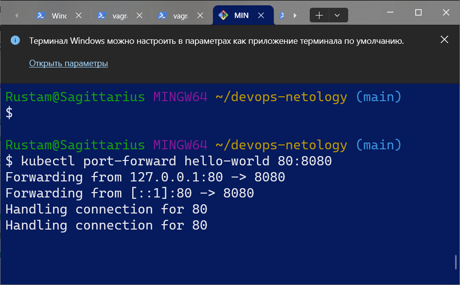
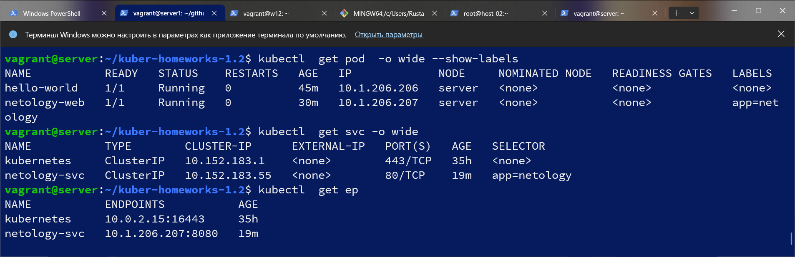
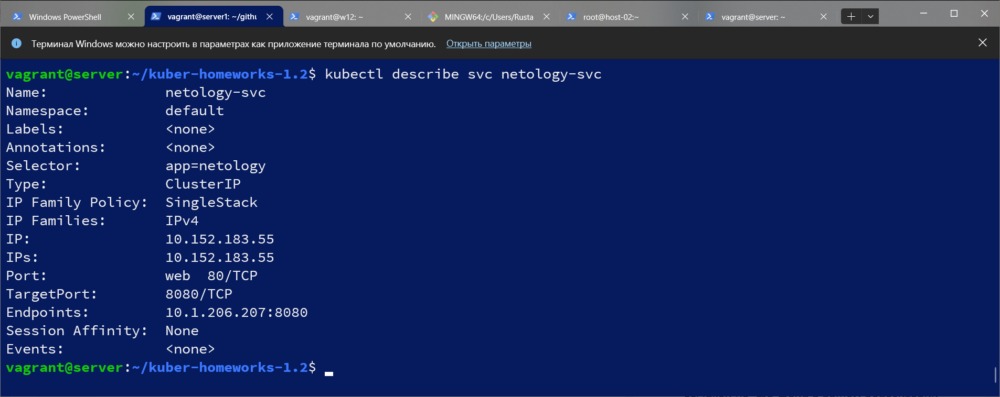
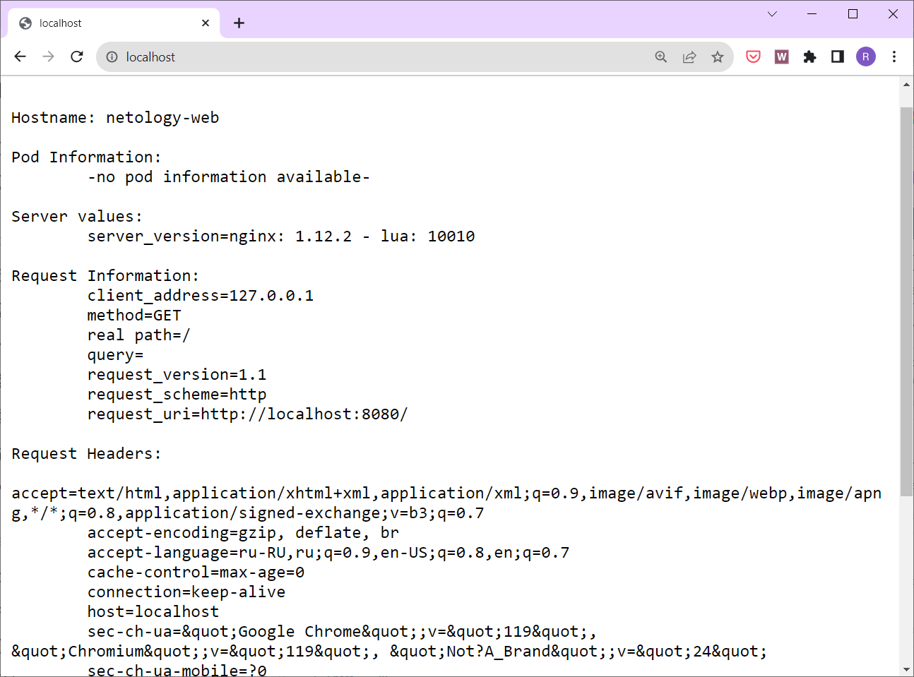

# Домашнее задание к занятию «Базовые объекты K8S»

### Цель задания

В тестовой среде для работы с Kubernetes, установленной в предыдущем ДЗ, необходимо развернуть Pod с приложением и подключиться к нему со своего локального компьютера. 

------

### Чеклист готовности к домашнему заданию

1. Установленное k8s-решение (например, MicroK8S).
2. Установленный локальный kubectl.
3. Редактор YAML-файлов с подключенным Git-репозиторием.

------

### Инструменты и дополнительные материалы, которые пригодятся для выполнения задания

1. Описание [Pod](https://kubernetes.io/docs/concepts/workloads/pods/) и примеры манифестов.
2. Описание [Service](https://kubernetes.io/docs/concepts/services-networking/service/).

------

### Задание 1. Создать Pod с именем hello-world

1. Создать манифест (yaml-конфигурацию) Pod.
2. Использовать image - gcr.io/kubernetes-e2e-test-images/echoserver:2.2.
3. Подключиться локально к Pod с помощью `kubectl port-forward` и вывести значение (curl или в браузере).

#### Решение
```
apiVersion: v1
kind: Pod
metadata:
  name: hello-world
spec:
  containers:
  - name: hello-world
    image: gcr.io/kubernetes-e2e-test-images/echoserver:2.2
```

```
Hostname: hello-world

Pod Information:
	-no pod information available-

Server values:
	server_version=nginx: 1.12.2 - lua: 10010

Request Information:
	client_address=127.0.0.1
	method=GET
	real path=/
	query=
	request_version=1.1
	request_scheme=http
	request_uri=http://localhost:8080/

Request Headers:
	accept=text/html,application/xhtml+xml,application/xml;q=0.9,image/avif,image/webp,image/apng,*/*;q=0.8,application/signed-exchange;v=b3;q=0.7  
	accept-encoding=gzip, deflate, br  
	accept-language=ru-RU,ru;q=0.9,en-US;q=0.8,en;q=0.7  
	cache-control=max-age=0  
	connection=keep-alive  
	host=localhost  
	sec-ch-ua=&quot;Google Chrome&quot;;v=&quot;119&quot;, &quot;Chromium&quot;;v=&quot;119&quot;, &quot;Not?A_Brand&quot;;v=&quot;24&quot;  
	sec-ch-ua-mobile=?0  
	sec-ch-ua-platform=&quot;Windows&quot;  
	sec-fetch-dest=document  
	sec-fetch-mode=navigate  
	sec-fetch-site=cross-site  
	sec-fetch-user=?1  
	upgrade-insecure-requests=1  
	user-agent=Mozilla/5.0 (Windows NT 10.0; Win64; x64) AppleWebKit/537.36 (KHTML, like Gecko) Chrome/119.0.0.0 Safari/537.36  

Request Body:
	-no body in request-

```

------

### Задание 2. Создать Service и подключить его к Pod

1. Создать Pod с именем netology-web.
2. Использовать image — gcr.io/kubernetes-e2e-test-images/echoserver:2.2.
3. Создать Service с именем netology-svc и подключить к netology-web.
4. Подключиться локально к Service с помощью `kubectl port-forward` и вывести значение (curl или в браузере).

#### Решение
```
apiVersion: v1
kind: Pod
metadata:
  labels:
    app: netology
  name: netology-web

spec:
  containers:
  - name: netology-web
    image: gcr.io/kubernetes-e2e-test-images/echoserver:2.2
   
```
```
apiVersion: v1
kind: Service
metadata:
  name: netology-svc
spec:
  ports:
    - name: web
      port: 80
      targetPort: 8080
  selector:
    app: netology

```





------
[hello](./hello.yml)   
[web](./netology-web.yml)  
[svc](./netology-svc.yml)  
### Правила приёма работы

1. Домашняя работа оформляется в своем Git-репозитории в файле README.md. Выполненное домашнее задание пришлите ссылкой на .md-файл в вашем репозитории.
2. Файл README.md должен содержать скриншоты вывода команд `kubectl get pods`, а также скриншот результата подключения.
3. Репозиторий должен содержать файлы манифестов и ссылки на них в файле README.md.

------

### Критерии оценки
Зачёт — выполнены все задания, ответы даны в развернутой форме, приложены соответствующие скриншоты и файлы проекта, в выполненных заданиях нет противоречий и нарушения логики.

На доработку — задание выполнено частично или не выполнено, в логике выполнения заданий есть противоречия, существенные недостатки.