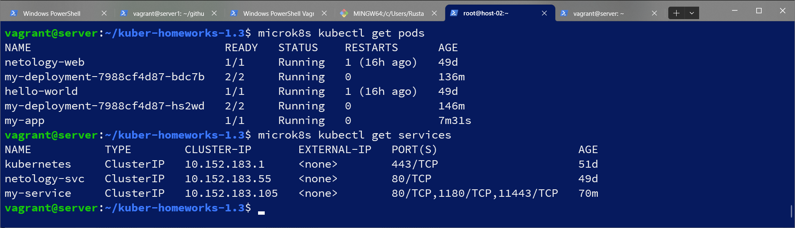
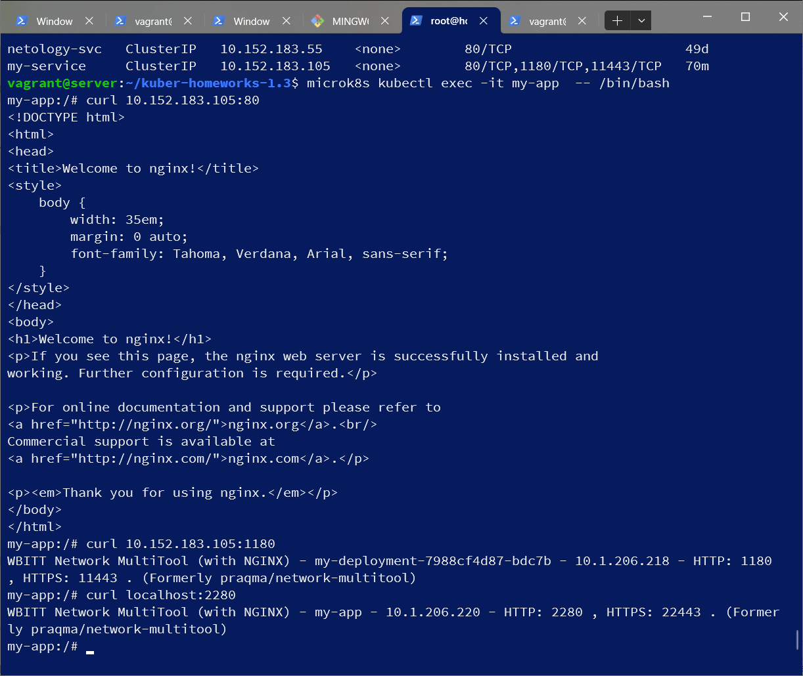
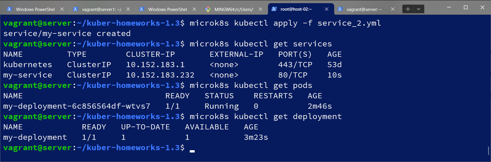
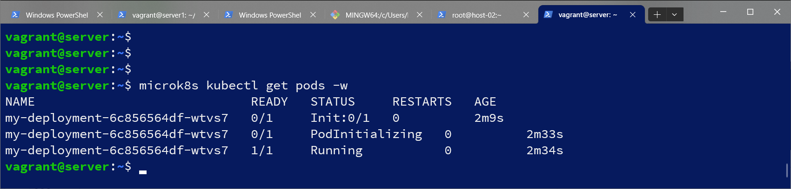

# Домашнее задание к занятию «Запуск приложений в K8S»

### Цель задания

В тестовой среде для работы с Kubernetes, установленной в предыдущем ДЗ, необходимо развернуть Deployment с приложением, состоящим из нескольких контейнеров, и масштабировать его.

------

### Чеклист готовности к домашнему заданию

1. Установленное k8s-решение (например, MicroK8S).
2. Установленный локальный kubectl.
3. Редактор YAML-файлов с подключённым git-репозиторием.

------

### Инструменты и дополнительные материалы, которые пригодятся для выполнения задания

1. [Описание](https://kubernetes.io/docs/concepts/workloads/controllers/deployment/) Deployment и примеры манифестов.
2. [Описание](https://kubernetes.io/docs/concepts/workloads/pods/init-containers/) Init-контейнеров.
3. [Описание](https://github.com/wbitt/Network-MultiTool) Multitool.

------

### Задание 1. Создать Deployment и обеспечить доступ к репликам приложения из другого Pod

1. Создать Deployment приложения, состоящего из двух контейнеров — nginx и multitool. Решить возникшую ошибку.
2. После запуска увеличить количество реплик работающего приложения до 2.
3. Продемонстрировать количество подов до и после масштабирования.
4. Создать Service, который обеспечит доступ до реплик приложений из п.1.
5. Создать отдельный Pod с приложением multitool и убедиться с помощью `curl`, что из пода есть доступ до приложений из п.1.
#### Решение  
```
apiVersion: apps/v1
kind: Deployment
metadata:
  name: my-deployment
  labels:
    app: app1
spec:
  replicas: 1
  selector:
    matchLabels:
      app: app1
  template:
    metadata:
      labels:
        app: app1
    spec:
      containers:
      - name: nginx
        image: nginx:1.19.2
        ports:
        - containerPort: 80
      - name: multitool
        image: wbitt/network-multitool

vagrant@server:~/kuber-homeworks-1.3$ microk8s kubectl get deployments
NAME            READY   UP-TO-DATE   AVAILABLE   AGE
my-deployment   0/1     1            0           3m22s

vagrant@server:~/kuber-homeworks-1.3$ microk8s kubectl get pods -l app=app1
NAME                             READY   STATUS             RESTARTS       AGE
my-deployment-7b898f7b7b-j4s8g   1/2     CrashLoopBackOff   6 (103s ago)   8m5s

```
не запустился один контейнер
```
vagrant@server:~/kuber-homeworks-1.3$ microk8s kubectl describe pod my-deployment-7b898f7b7b-j4s8g
Name:             my-deployment-7b898f7b7b-j4s8g
Namespace:        default
Priority:         0
Service Account:  default
Node:             server/10.0.2.15
Start Time:       Sat, 06 Jan 2024 06:42:38 +0000
Labels:           app=app1
                  pod-template-hash=7b898f7b7b
Annotations:      cni.projectcalico.org/containerID: f411a70ec171f1fd53b5b007ac67afa77576f8202dde14ce5647904f7801d8d9
                  cni.projectcalico.org/podIP: 10.1.206.216/32
                  cni.projectcalico.org/podIPs: 10.1.206.216/32
Status:           Running
IP:               10.1.206.216
IPs:
  IP:           10.1.206.216
Controlled By:  ReplicaSet/my-deployment-7b898f7b7b
Containers:
  nginx:
    Container ID:   containerd://8eb3b12da7cf97df4aa2911c757b85f407b8c2b8b9c11df2e343babeb4a247a3
    Image:          nginx:1.19.2
    Image ID:       docker.io/library/nginx@sha256:c628b67d21744fce822d22fdcc0389f6bd763daac23a6b77147d0712ea7102d0
    Port:           80/TCP
    Host Port:      0/TCP
    State:          Running
      Started:      Sat, 06 Jan 2024 06:42:41 +0000
    Ready:          True
    Restart Count:  0
    Environment:    <none>
    Mounts:
      /var/run/secrets/kubernetes.io/serviceaccount from kube-api-access-64ghn (ro)
  multitool:
    Container ID:   containerd://6743e358bdb78a16a175b6eec1a2dc0135db88c5e4d82508aa27fac5802cf9ee
    Image:          wbitt/network-multitool
    Image ID:       docker.io/wbitt/network-multitool@sha256:d1137e87af76ee15cd0b3d4c7e2fcd111ffbd510ccd0af076fc98dddfc50a735
    Port:           <none>
    Host Port:      <none>
    State:          Waiting
      Reason:       CrashLoopBackOff
    Last State:     Terminated
      Reason:       Error
      Exit Code:    1
      Started:      Sat, 06 Jan 2024 06:48:57 +0000
      Finished:     Sat, 06 Jan 2024 06:49:00 +0000
    Ready:          False
    Restart Count:  6
    Environment:    <none>
    Mounts:
      /var/run/secrets/kubernetes.io/serviceaccount from kube-api-access-64ghn (ro)
Conditions:
  Type              Status
  Initialized       True
  Ready             False
  ContainersReady   False
  PodScheduled      True
Volumes:
  kube-api-access-64ghn:
    Type:                    Projected (a volume that contains injected data from multiple sources)
    TokenExpirationSeconds:  3607
    ConfigMapName:           kube-root-ca.crt
    ConfigMapOptional:       <nil>
    DownwardAPI:             true
QoS Class:                   BestEffort
Node-Selectors:              <none>
Tolerations:                 node.kubernetes.io/not-ready:NoExecute op=Exists for 300s
                             node.kubernetes.io/unreachable:NoExecute op=Exists for 300s
Events:
  Type    Reason   Age                    From     Message
  ----    ------   ----                   ----     -------
  Normal  Pulling  3m41s (x7 over 9m53s)  kubelet  Pulling image "wbitt/network-multitool"

```
проблема с multitool, вывод следующей команды показывает что порт 80 занят  
```
vagrant@server:~/kuber-homeworks-1.3$ microk8s kubectl logs my-deployment-7b898f7b7b-j4s8g -c multitool
```
переназначим порты для прослушивания с помощью переменных окружения:
```
vagrant@server:~/kuber-homeworks-1.3$ cat deployment.yml
apiVersion: apps/v1
kind: Deployment
metadata:
  name: my-deployment
  labels:
    app: app1
spec:
  replicas: 1
  selector:
    matchLabels:
      app: app1
  template:
    metadata:
      labels:
        app: app1
    spec:
      containers:
      - name: nginx
        image: nginx:1.19.2
        ports:
        - containerPort: 80
      - name: multitool
        image: wbitt/network-multitool
        env:
          - name: HTTP_PORT
            value: "1180"
          - name: HTTPS_PORT
            value: "11443"
            
```
```
vagrant@server:~/kuber-homeworks-1.3$ microk8s kubectl apply -f deployment.yml
deployment.apps/my-deployment configured
vagrant@server:~/kuber-homeworks-1.3$ kubectl get deployments
NAME            READY   UP-TO-DATE   AVAILABLE   AGE
my-deployment   1/1     1            1           36m
vagrant@server:~/kuber-homeworks-1.3$ microk8s kubectl get pods -l app=app1
NAME                             READY   STATUS    RESTARTS   AGE
my-deployment-7988cf4d87-hs2wd   2/2     Running   0          5m56s
```
все получилось.
Увеличиваем количество replicas: 2, применяем конфигурацию: 
```
vagrant@server:~/kuber-homeworks-1.3$ microk8s kubectl apply -f deployment.yml
deployment.apps/my-deployment configured
vagrant@server:~/kuber-homeworks-1.3$
vagrant@server:~/kuber-homeworks-1.3$ microk8s kubectl get pods -l app=app1
NAME                             READY   STATUS    RESTARTS   AGE
my-deployment-7988cf4d87-hs2wd   2/2     Running   0          10m
my-deployment-7988cf4d87-bdc7b   2/2     Running   0          7s
```
сервис:
```
apiVersion: v1
kind: Service
metadata:
  name: my-service
spec:
  selector:
    app: app1
  ports:
    - name: nginx
      protocol: TCP
      port: 80
      targetPort: 80
    - name: multitool-http
      protocol: TCP
      port: 1180
      targetPort: 1180
    - name: multitool-https
      protocol: TCP
      port: 11443
```
pod:
```
apiVersion: v1
kind: Pod
metadata:
  labels:
    app: my-multitool
  name: my-app

spec:
  containers:
  - name: multitool
    image: wbitt/network-multitool
    env:
      - name: HTTP_PORT
        value: "2280"
      - name: HTTPS_PORT
        value: "22443"
    ports:
    - containerPort: 2280
    - containerPort: 22443
```
проверяем доступность:

```
vagrant@server:~/kuber-homeworks-1.3$ microk8s kubectl exec -it my-app  -- /bin/bash
my-app:/# curl 10.152.183.105:80
<!DOCTYPE html>
<html>
<head>
<title>Welcome to nginx!</title>
<style>
    body {
        width: 35em;
        margin: 0 auto;
        font-family: Tahoma, Verdana, Arial, sans-serif;
    }
</style>
</head>
<body>
<h1>Welcome to nginx!</h1>
<p>If you see this page, the nginx web server is successfully installed and
working. Further configuration is required.</p>

<p>For online documentation and support please refer to
<a href="http://nginx.org/">nginx.org</a>.<br/>
Commercial support is available at
<a href="http://nginx.com/">nginx.com</a>.</p>

<p><em>Thank you for using nginx.</em></p>
</body>
</html>

my-app:/# curl 10.152.183.105:1180
WBITT Network MultiTool (with NGINX) - my-deployment-7988cf4d87-bdc7b - 10.1.206.218 - HTTP: 1180 , HTTPS: 11443 . (Formerly praqma/network-multitool)

my-app:/# curl localhost:2280
WBITT Network MultiTool (with NGINX) - my-app - 10.1.206.220 - HTTP: 2280 , HTTPS: 22443 . (Formerly praqma/network-multitool)
```

------

### Задание 2. Создать Deployment и обеспечить старт основного контейнера при выполнении условий

1. Создать Deployment приложения nginx и обеспечить старт контейнера только после того, как будет запущен сервис этого приложения.
2. Убедиться, что nginx не стартует. В качестве Init-контейнера взять busybox.
3. Создать и запустить Service. Убедиться, что Init запустился.
4. Продемонстрировать состояние пода до и после запуска сервиса.

deployment_2.yml:
```
apiVersion: apps/v1
kind: Deployment
metadata:
  name: my-deployment
  labels:
    app: app2
spec:
  replicas: 1
  selector:
    matchLabels:
      app: app2
  template:
    metadata:
      labels:
        app: app2
    spec:
      initContainers:
      - name: busybox
        image: busybox
        command: ['sh', '-c', 'until nslookup my-service.default.svc.cluster.local; do echo waiting for my-service; sleep 2; done']
      containers:
      - name: nginx
        image: nginx:1.19.2
        ports:
        - containerPort: 80
```


service_2.yml:
```
apiVersion: v1
kind: Service
metadata:
  name: my-service
spec:
  selector:
    app: app2
  ports:
    - name: nginx
      protocol: TCP
      port: 80
      targetPort: 80
```




------

### Правила приема работы

1. Домашняя работа оформляется в своем Git-репозитории в файле README.md. Выполненное домашнее задание пришлите ссылкой на .md-файл в вашем репозитории.
2. Файл README.md должен содержать скриншоты вывода необходимых команд `kubectl` и скриншоты результатов.
3. Репозиторий должен содержать файлы манифестов и ссылки на них в файле README.md.

------