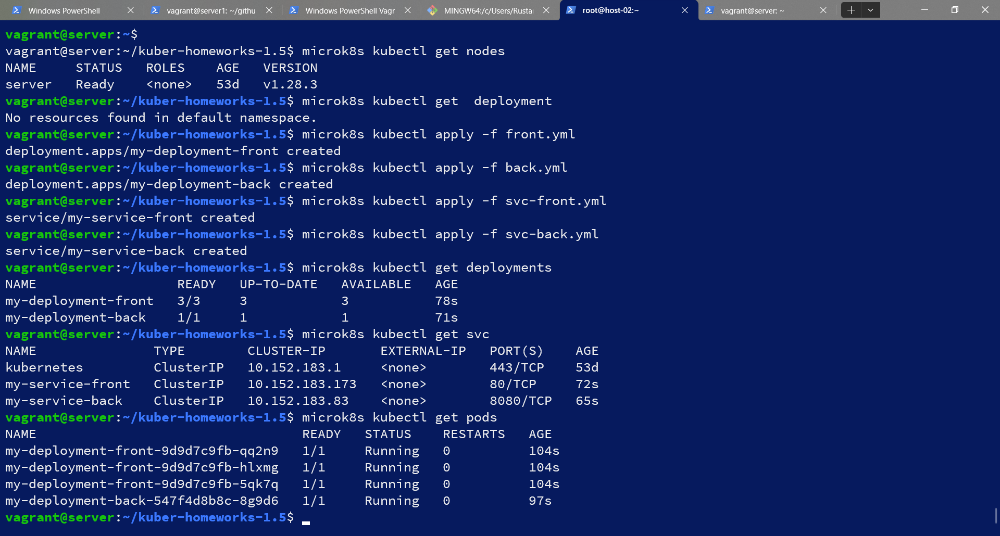
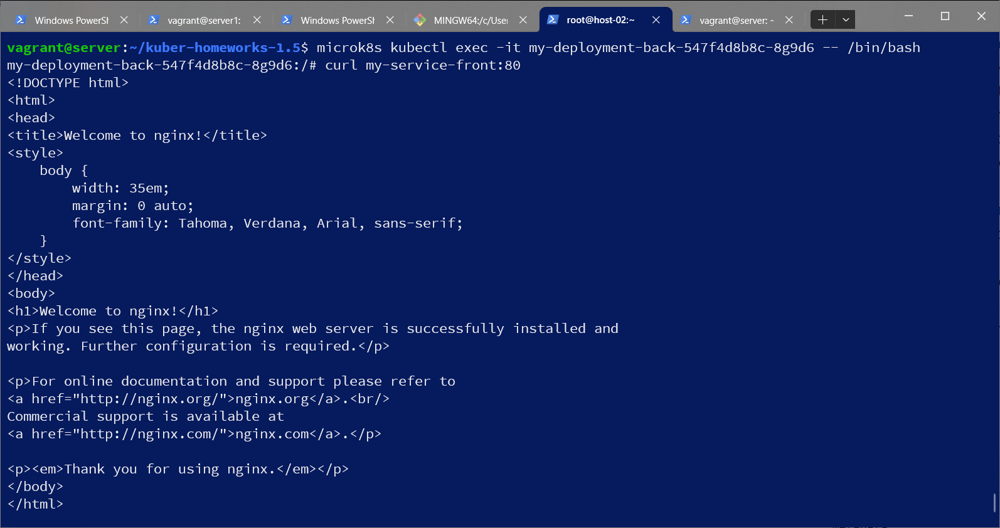
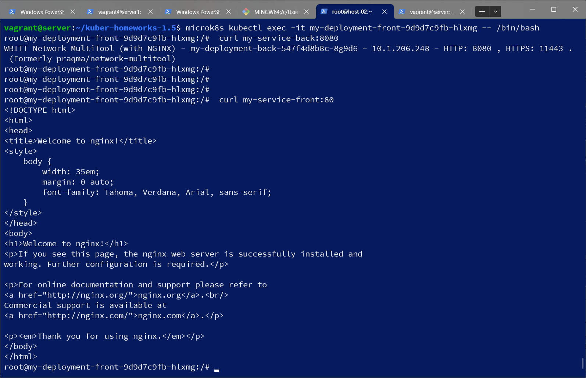

# Домашнее задание к занятию «Сетевое взаимодействие в K8S. Часть 2»

### Цель задания

В тестовой среде Kubernetes необходимо обеспечить доступ к двум приложениям снаружи кластера по разным путям.

------

### Чеклист готовности к домашнему заданию

1. Установленное k8s-решение (например, MicroK8S).
2. Установленный локальный kubectl.
3. Редактор YAML-файлов с подключённым Git-репозиторием.

------

### Инструменты и дополнительные материалы, которые пригодятся для выполнения задания

1. [Инструкция](https://microk8s.io/docs/getting-started) по установке MicroK8S.
2. [Описание](https://kubernetes.io/docs/concepts/services-networking/service/) Service.
3. [Описание](https://kubernetes.io/docs/concepts/services-networking/ingress/) Ingress.
4. [Описание](https://github.com/wbitt/Network-MultiTool) Multitool.

------

### Задание 1. Создать Deployment приложений backend и frontend

1. Создать Deployment приложения _frontend_ из образа nginx с количеством реплик 3 шт.
2. Создать Deployment приложения _backend_ из образа multitool. 
3. Добавить Service, которые обеспечат доступ к обоим приложениям внутри кластера. 
4. Продемонстрировать, что приложения видят друг друга с помощью Service.
5. Предоставить манифесты Deployment и Service в решении, а также скриншоты или вывод команды п.4.

#### Решение

deployment front.yml:
```
vagrant@server:~/kuber-homeworks-1.5$ cat front.yml
apiVersion: apps/v1
kind: Deployment
metadata:
  name: my-deployment-front
  labels:
    app: app-front
spec:
  replicas: 3
  selector:
    matchLabels:
      app: app-front
  template:
    metadata:
      labels:
        app: app-front
    spec:
      containers:
      - name: nginx
        image: nginx:1.19.2
        ports:
        - containerPort: 80
```
deployment back.yml:
```
vagrant@server:~/kuber-homeworks-1.5$ cat back.yml
apiVersion: apps/v1
kind: Deployment
metadata:
  name: my-deployment-back
  labels:
    app: app-back
spec:
  replicas: 1
  selector:
    matchLabels:
      app: app-back
  template:
    metadata:
      labels:
        app: app-back
    spec:
      containers:
      - name: multitool
        image: wbitt/network-multitool
        env:
          - name: HTTP_PORT
            value: "8080"
          - name: HTTPS_PORT
            value: "11443"

```
services:
```
vagrant@server:~/kuber-homeworks-1.5$ cat svc-front.yml
apiVersion: v1
kind: Service
metadata:
  name: my-service-front
spec:
  selector:
    app: app-front
  ports:
    - name: nginx
      protocol: TCP
      port: 80
      targetPort: 80
vagrant@server:~/kuber-homeworks-1.5$ cat svc-back.yml
apiVersion: v1
kind: Service
metadata:
  name: my-service-back
spec:
  selector:
    app: app-back
  ports:
    - name: multitool-http
      protocol: TCP
      port: 8080
      targetPort: 8080
```




проверяем доступность:




------

### Задание 2. Создать Ingress и обеспечить доступ к приложениям снаружи кластера

1. Включить Ingress-controller в MicroK8S.
2. Создать Ingress, обеспечивающий доступ снаружи по IP-адресу кластера MicroK8S так, чтобы при запросе только по адресу открывался _frontend_ а при добавлении /api - _backend_.
3. Продемонстрировать доступ с помощью браузера или `curl` с локального компьютера.
4. Предоставить манифесты и скриншоты или вывод команды п.2.

#### Решение
включаем ингрес контроллер:
```
vagrant@server:~/kuber-homeworks-1.5$ microk8s enable ingress
Infer repository core for addon ingress
Enabling Ingress
ingressclass.networking.k8s.io/public created
ingressclass.networking.k8s.io/nginx created
namespace/ingress created
serviceaccount/nginx-ingress-microk8s-serviceaccount created
clusterrole.rbac.authorization.k8s.io/nginx-ingress-microk8s-clusterrole created
role.rbac.authorization.k8s.io/nginx-ingress-microk8s-role created
clusterrolebinding.rbac.authorization.k8s.io/nginx-ingress-microk8s created
rolebinding.rbac.authorization.k8s.io/nginx-ingress-microk8s created
configmap/nginx-load-balancer-microk8s-conf created
configmap/nginx-ingress-tcp-microk8s-conf created
configmap/nginx-ingress-udp-microk8s-conf created
daemonset.apps/nginx-ingress-microk8s-controller created
Ingress is enabled
```
ingress.yml:
```
vagrant@server:~/kuber-homeworks-1.5$ cat ingress.yml
apiVersion: networking.k8s.io/v1
kind: Ingress
metadata:
  name: my-ingress
  annotations:
    nginx.ingress.kubernetes.io/rewrite-target: /$1
    nginx.ingress.kubernetes.io/use-forwarded-headers: "true"
spec:
  rules:
    - host:
      http:
        paths:
          - path: /
            pathType: Prefix
            backend:
              service:
                name: my-service-front
                port:
                  number: 80
          - path: /api
            pathType: Prefix
            backend:
              service:
                name: my-service-back
                port:
                  number: 8080
```
проверка frontend:

проверка backend


------

### Правила приема работы

1. Домашняя работа оформляется в своем Git-репозитории в файле README.md. Выполненное домашнее задание пришлите ссылкой на .md-файл в вашем репозитории.
2. Файл README.md должен содержать скриншоты вывода необходимых команд `kubectl` и скриншоты результатов.
3. Репозиторий должен содержать тексты манифестов или ссылки на них в файле README.md.

------