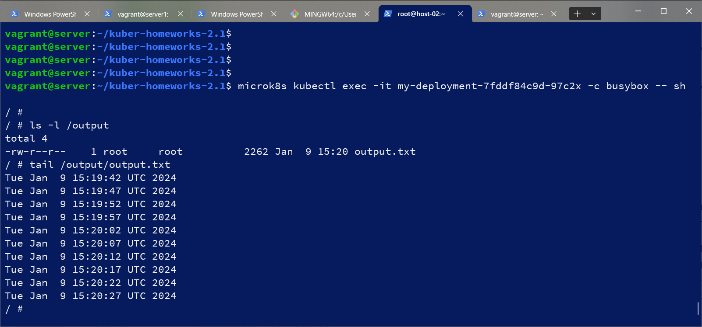
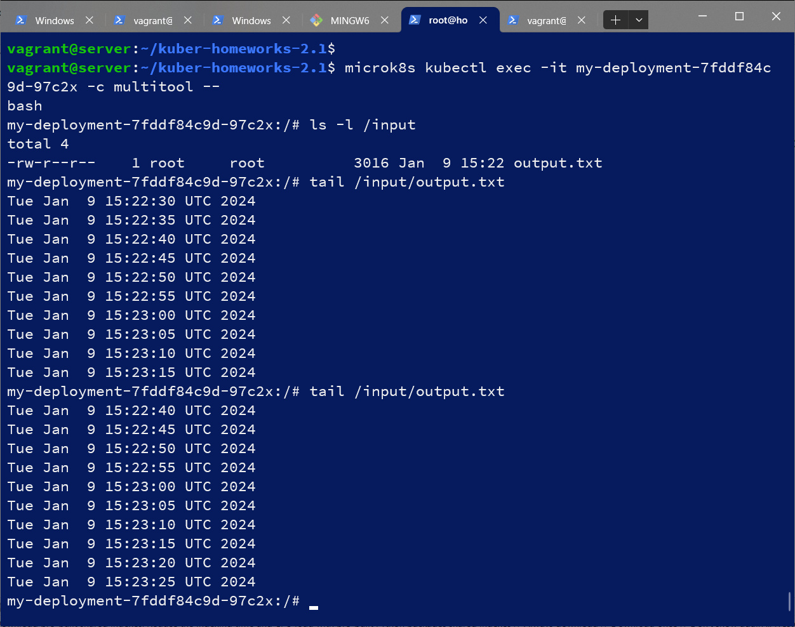
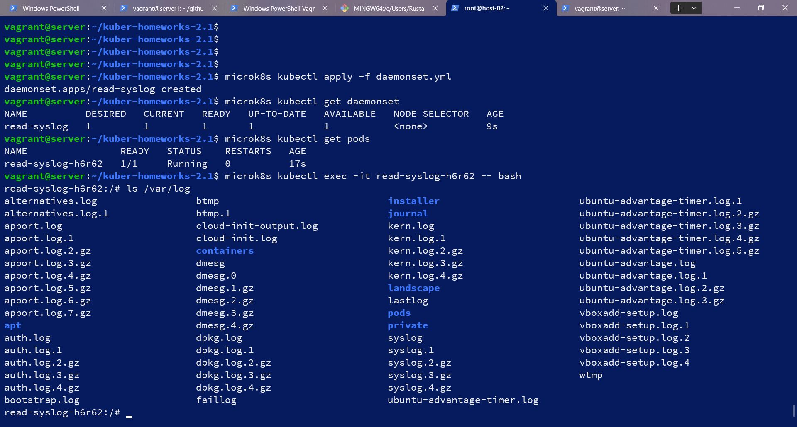
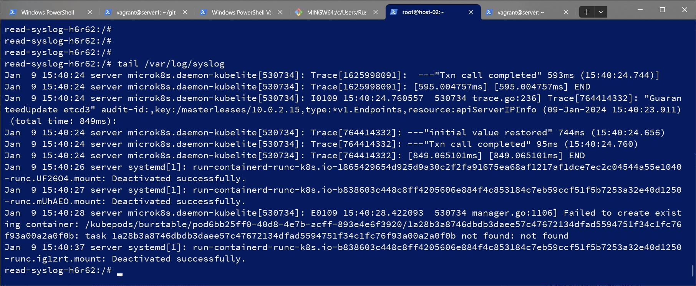

# Домашнее задание к занятию «Хранение в K8s. Часть 1»

### Цель задания

В тестовой среде Kubernetes нужно обеспечить обмен файлами между контейнерам пода и доступ к логам ноды.

------

### Чеклист готовности к домашнему заданию

1. Установленное K8s-решение (например, MicroK8S).
2. Установленный локальный kubectl.
3. Редактор YAML-файлов с подключенным GitHub-репозиторием.

------

### Дополнительные материалы для выполнения задания

1. [Инструкция по установке MicroK8S](https://microk8s.io/docs/getting-started).
2. [Описание Volumes](https://kubernetes.io/docs/concepts/storage/volumes/).
3. [Описание Multitool](https://github.com/wbitt/Network-MultiTool).

------

### Задание 1 

**Что нужно сделать**

Создать Deployment приложения, состоящего из двух контейнеров и обменивающихся данными.

1. Создать Deployment приложения, состоящего из контейнеров busybox и multitool.
2. Сделать так, чтобы busybox писал каждые пять секунд в некий файл в общей директории.
3. Обеспечить возможность чтения файла контейнером multitool.
4. Продемонстрировать, что multitool может читать файл, который периодоически обновляется.
5. Предоставить манифесты Deployment в решении, а также скриншоты или вывод команды из п. 4.

#### Решение
deployment.yml:
```
vagrant@server:~/kuber-homeworks-2.1$ cat deployment.yml
apiVersion: apps/v1
kind: Deployment
metadata:
  name: my-deployment
  labels:
    app: app3
spec:
  replicas: 1
  selector:
    matchLabels:
      app: app3
  template:
    metadata:
      labels:
        app: app3
    spec:
      containers:
      - name: multitool
        image: wbitt/network-multitool
        env:
          - name: HTTP_PORT
            value: "8080"
          - name: HTTPS_PORT
            value: "11443"
        volumeMounts:
          - name: shared-volume
            mountPath: /input
      - name: busybox
        image: busybox
        command: ['sh', '-c', "while true; do date >> /output/output.txt; sleep 5; done"]
        volumeMounts:
          - name: shared-volume
            mountPath: /output
      volumes:
      - name: shared-volume
        emptyDir: {}
```
output in busybox:

input in multitool


------

### Задание 2

**Что нужно сделать**

Создать DaemonSet приложения, которое может прочитать логи ноды.

1. Создать DaemonSet приложения, состоящего из multitool.
2. Обеспечить возможность чтения файла `/var/log/syslog` кластера MicroK8S.
3. Продемонстрировать возможность чтения файла изнутри пода.
4. Предоставить манифесты Deployment, а также скриншоты или вывод команды из п. 2.

#### Решение

daemonset.yml:

```
vagrant@server:~/kuber-homeworks-2.1$ cat daemonset.yml
apiVersion: apps/v1
kind: DaemonSet
metadata:
  name: read-syslog
  labels:
    app: app4
spec:
  selector:
    matchLabels:
      app: app4
  template:
    metadata:
      labels:
        app: app4
    spec:
      containers:
      - name: multitool
        image: wbitt/network-multitool
        volumeMounts:
        - name: var-log
          mountPath: /var/log
      volumes:
      - name: var-log
        hostPath:
          path: /var/log
          type: ""

```
содержимое каталога  /var/log изнутри пода:


последние строчки /var/log/syslog изнутри пода:


------

### Правила приёма работы

1. Домашняя работа оформляется в своём Git-репозитории в файле README.md. Выполненное задание пришлите ссылкой на .md-файл в вашем репозитории.
2. Файл README.md должен содержать скриншоты вывода необходимых команд `kubectl`, а также скриншоты результатов.
3. Репозиторий должен содержать тексты манифестов или ссылки на них в файле README.md.

------