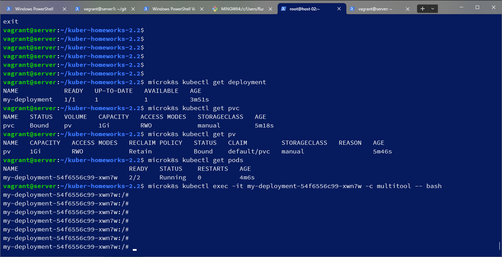
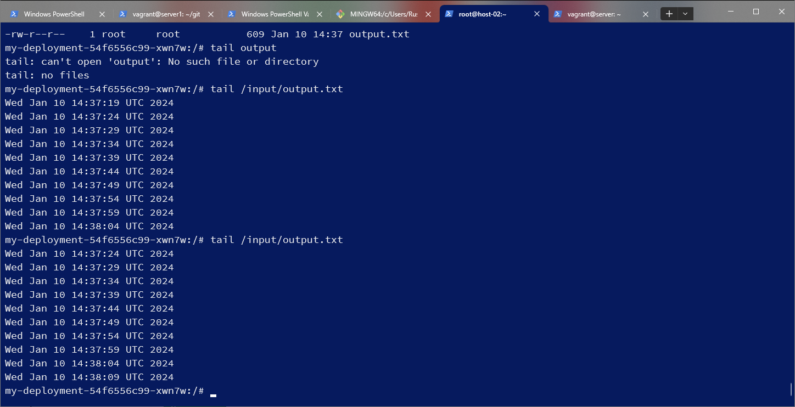
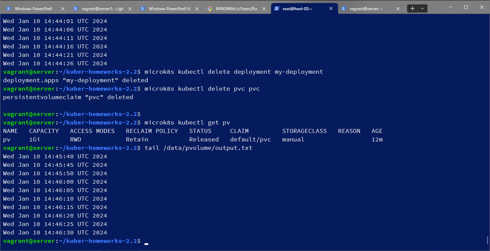
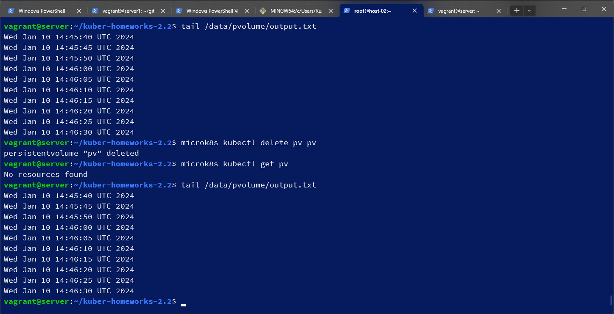
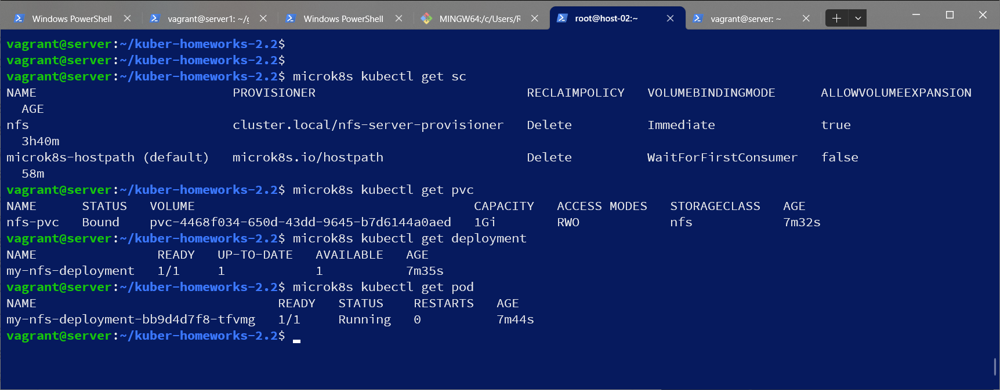
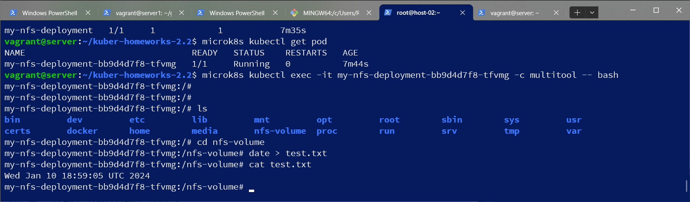

# Домашнее задание к занятию «Хранение в K8s. Часть 2»

### Цель задания

В тестовой среде Kubernetes нужно создать PV и продемострировать запись и хранение файлов.

------

### Чеклист готовности к домашнему заданию

1. Установленное K8s-решение (например, MicroK8S).
2. Установленный локальный kubectl.
3. Редактор YAML-файлов с подключенным GitHub-репозиторием.

------

### Дополнительные материалы для выполнения задания

1. [Инструкция по установке NFS в MicroK8S](https://microk8s.io/docs/nfs). 
2. [Описание Persistent Volumes](https://kubernetes.io/docs/concepts/storage/persistent-volumes/). 
3. [Описание динамического провижининга](https://kubernetes.io/docs/concepts/storage/dynamic-provisioning/). 
4. [Описание Multitool](https://github.com/wbitt/Network-MultiTool).

------

### Задание 1

**Что нужно сделать**

Создать Deployment приложения, использующего локальный PV, созданный вручную.

1. Создать Deployment приложения, состоящего из контейнеров busybox и multitool.
2. Создать PV и PVC для подключения папки на локальной ноде, которая будет использована в поде.
3. Продемонстрировать, что multitool может читать файл, в который busybox пишет каждые пять секунд в общей директории. 
4. Удалить Deployment и PVC. Продемонстрировать, что после этого произошло с PV. Пояснить, почему.
5. Продемонстрировать, что файл сохранился на локальном диске ноды. Удалить PV.  Продемонстрировать что произошло с файлом после удаления PV. Пояснить, почему.
5. Предоставить манифесты, а также скриншоты или вывод необходимых команд.
#### Решение
deployment.yml:
```
vagrant@server:~/kuber-homeworks-2.2$ cat deployment.yml
apiVersion: apps/v1
kind: Deployment
metadata:
  name: my-deployment
  labels:
    app: app5
spec:
  replicas: 1
  selector:
    matchLabels:
      app: app5
  template:
    metadata:
      labels:
        app: app5
    spec:
      containers:
      - name: multitool
        image: wbitt/network-multitool
        env:
          - name: HTTP_PORT
            value: "8080"
          - name: HTTPS_PORT
            value: "11443"
        volumeMounts:
          - name: pvc
            mountPath: /input
      - name: busybox
        image: busybox
        command: ['sh', '-c', "while true; do date >> /output/output.txt; sleep 5; done"]
        volumeMounts:
          - name: pvc
            mountPath: /output
      volumes:
      - name: pvc
        persistentVolumeClaim:
          claimName: pvc
```
pv.yml:
```
vagrant@server:~/kuber-homeworks-2.2$ cat pv.yml
apiVersion: v1
kind: PersistentVolume
metadata:
  name: pv
spec:
  storageClassName: manual
  capacity:
    storage: 1Gi
  accessModes:
    - ReadWriteOnce
  hostPath:
    path: /data/pvolume
  persistentVolumeReclaimPolicy: Retain
```
pvc.yml:
```
vagrant@server:~/kuber-homeworks-2.2$ cat pvc.yml
apiVersion: v1
kind: PersistentVolumeClaim
metadata:
  name: pvc
spec:
  storageClassName: manual
  accessModes:
    - ReadWriteOnce
  resources:
    requests:
      storage: 1Gi
```


multitool чтение файла:

после удаления pv и deployment pv остался, он не зависит от пода и pvc:

после удаления pv файл также остался благодаря опции persistentVolumeReclaimPolicy: Retain, 


------

### Задание 2

**Что нужно сделать**

Создать Deployment приложения, которое может хранить файлы на NFS с динамическим созданием PV.

1. Включить и настроить NFS-сервер на MicroK8S.
2. Создать Deployment приложения состоящего из multitool, и подключить к нему PV, созданный автоматически на сервере NFS.
3. Продемонстрировать возможность чтения и записи файла изнутри пода. 
4. Предоставить манифесты, а также скриншоты или вывод необходимых команд.
#### Решение

```
vagrant@server:~/kuber-homeworks-2.2$ microk8s enable community
vagrant@server:~/kuber-homeworks-2.2$ sudo apt install nfs-common
vagrant@server:~/kuber-homeworks-2.2$ microk8s enable nfs
vagrant@server:~/kuber-homeworks-2.1$
vagrant@server:~/kuber-homeworks-2.2$ microk8s enable storage
vagrant@server:~/kuber-homeworks-2.2$ microk8s kubectl get sc
NAME                          PROVISIONER                            RECLAIMPOLICY   VOLUMEBINDINGMODE      ALLOWVOLUMEEXPANSION   AGE
nfs                           cluster.local/nfs-server-provisioner   Delete          Immediate              true                   164m
microk8s-hostpath (default)   microk8s.io/hostpath                   Delete          WaitForFirstConsumer   false                  118s
```
depolyment2.yml
```
vagrant@server:~/kuber-homeworks-2.2$ cat deployment2.yml
apiVersion: apps/v1
kind: Deployment
metadata:
  name: my-nfs-deployment
  labels:
    app: app6
spec:
  replicas: 1
  selector:
    matchLabels:
      app: app6
  template:
    metadata:
      labels:
        app: app6
    spec:
      containers:
        - name: multitool
          image: wbitt/network-multitool
          volumeMounts:
          - name: nfs
            mountPath: /nfs-volume
          env:
          - name: HTTP_PORT
            value: "8080"
          - name: HTTPS_PORT
            value: "11443"
      volumes:
      - name: nfs
        persistentVolumeClaim:
          claimName: nfs-pvc
```
pvc2.yml:
```
vagrant@server:~/kuber-homeworks-2.2$ cat pvc2.yml
apiVersion: v1
kind: PersistentVolumeClaim
metadata:
  name: nfs-pvc
spec:
  storageClassName: nfs
  accessModes: [ReadWriteOnce]
  resources:
    requests:
      storage: 1Gi
```

чтение и запись внутри пода


------

### Правила приёма работы

1. Домашняя работа оформляется в своём Git-репозитории в файле README.md. Выполненное задание пришлите ссылкой на .md-файл в вашем репозитории.
2. Файл README.md должен содержать скриншоты вывода необходимых команд `kubectl`, а также скриншоты результатов.
3. Репозиторий должен содержать тексты манифестов или ссылки на них в файле README.md.