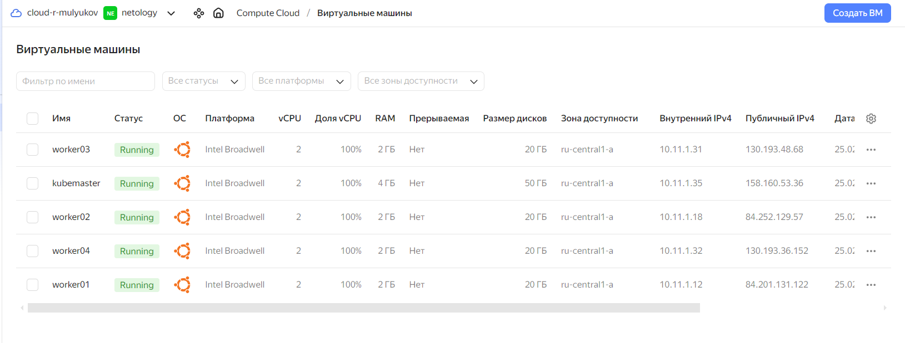
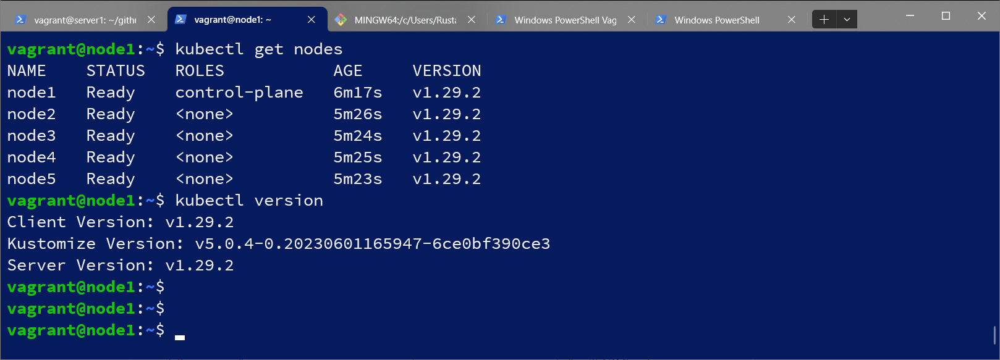
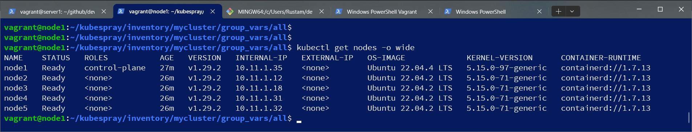

# Домашнее задание к занятию «Установка Kubernetes»

### Цель задания

Установить кластер K8s.

### Чеклист готовности к домашнему заданию

1. Развёрнутые ВМ с ОС Ubuntu 20.04-lts.


### Инструменты и дополнительные материалы, которые пригодятся для выполнения задания

1. [Инструкция по установке kubeadm](https://kubernetes.io/docs/setup/production-environment/tools/kubeadm/create-cluster-kubeadm/).
2. [Документация kubespray](https://kubespray.io/).

-----

### Задание 1. Установить кластер k8s с 1 master node

1. Подготовка работы кластера из 5 нод: 1 мастер и 4 рабочие ноды.
2. В качестве CRI — containerd.
3. Запуск etcd производить на мастере.
4. Способ установки выбрать самостоятельно.

#### Решение
Подготовил 5 виртуальных машин в yandex cloud,

сделал клон репозитория:
```
vagrant@node1:~$ git clone https://github.com/kubernetes-sigs/kubespray
```
Установил зависимости:
```
vagrant@node1:~/kubespray$ sudo pip3 install -r requirements.txt
Collecting ansible==8.5.0
  Downloading ansible-8.5.0-py3-none-any.whl (47.5 MB)
     ━━━━━━━━━━━━━━━━━━━━━━━━━━━━━━━━━━━━━━━━ 47.5/47.5 MB 3.8 MB/s eta 0:00:00
Collecting cryptography==41.0.4
  Downloading cryptography-41.0.4-cp37-abi3-manylinux_2_28_x86_64.whl (4.4 MB)
     ━━━━━━━━━━━━━━━━━━━━━━━━━━━━━━━━━━━━━━━━ 4.4/4.4 MB 5.0 MB/s eta 0:00:00
Collecting jinja2==3.1.2
  Downloading Jinja2-3.1.2-py3-none-any.whl (133 kB)
     ━━━━━━━━━━━━━━━━━━━━━━━━━━━━━━━━━━━━━━━━ 133.1/133.1 KB 6.0 MB/s eta 0:00:00
Collecting jmespath==1.0.1
  Downloading jmespath-1.0.1-py3-none-any.whl (20 kB)
Collecting MarkupSafe==2.1.3
  Downloading MarkupSafe-2.1.3-cp310-cp310-manylinux_2_17_x86_64.manylinux2014_x86_64.whl (25 kB)
Collecting netaddr==0.9.0
  Downloading netaddr-0.9.0-py3-none-any.whl (2.2 MB)
     ━━━━━━━━━━━━━━━━━━━━━━━━━━━━━━━━━━━━━━━━ 2.2/2.2 MB 4.7 MB/s eta 0:00:00
Collecting pbr==5.11.1
  Downloading pbr-5.11.1-py2.py3-none-any.whl (112 kB)
     ━━━━━━━━━━━━━━━━━━━━━━━━━━━━━━━━━━━━━━━━ 112.7/112.7 KB 5.4 MB/s eta 0:00:00
Collecting ruamel.yaml==0.17.35
  Downloading ruamel.yaml-0.17.35-py3-none-any.whl (112 kB)
     ━━━━━━━━━━━━━━━━━━━━━━━━━━━━━━━━━━━━━━━━ 112.9/112.9 KB 5.8 MB/s eta 0:00:00
Collecting ruamel.yaml.clib==0.2.8
  Downloading ruamel.yaml.clib-0.2.8-cp310-cp310-manylinux_2_17_x86_64.manylinux2014_x86_64.manylinux_2_24_x86_64.whl (526 kB)
     ━━━━━━━━━━━━━━━━━━━━━━━━━━━━━━━━━━━━━━━━ 526.7/526.7 KB 6.4 MB/s eta 0:00:00
Collecting ansible-core~=2.15.5
  Downloading ansible_core-2.15.9-py3-none-any.whl (2.2 MB)
     ━━━━━━━━━━━━━━━━━━━━━━━━━━━━━━━━━━━━━━━━ 2.2/2.2 MB 5.9 MB/s eta 0:00:00
Collecting cffi>=1.12
  Downloading cffi-1.16.0-cp310-cp310-manylinux_2_17_x86_64.manylinux2014_x86_64.whl (443 kB)
     ━━━━━━━━━━━━━━━━━━━━━━━━━━━━━━━━━━━━━━━━ 443.9/443.9 KB 3.9 MB/s eta 0:00:00
Requirement already satisfied: PyYAML>=5.1 in /usr/lib/python3/dist-packages (from ansible-core~=2.15.5->ansible==8.5.0->-r requirements.txt (line 1)) (5.4.1)
Requirement already satisfied: packaging in /usr/lib/python3/dist-packages (from ansible-core~=2.15.5->ansible==8.5.0->-r requirements.txt (line 1)) (21.3)
Collecting resolvelib<1.1.0,>=0.5.3
  Downloading resolvelib-1.0.1-py2.py3-none-any.whl (17 kB)
Collecting pycparser
  Downloading pycparser-2.21-py2.py3-none-any.whl (118 kB)
     ━━━━━━━━━━━━━━━━━━━━━━━━━━━━━━━━━━━━━━━━ 118.7/118.7 KB 6.4 MB/s eta 0:00:00
Installing collected packages: resolvelib, netaddr, ruamel.yaml.clib, pycparser, pbr, MarkupSafe, jmespath, ruamel.yaml, jinja2, cffi, cryptography, ansible-core, ansible
  Attempting uninstall: netaddr
    Found existing installation: netaddr 0.8.0
    Not uninstalling netaddr at /usr/lib/python3/dist-packages, outside environment /usr
    Can't uninstall 'netaddr'. No files were found to uninstall.
  Attempting uninstall: MarkupSafe
    Found existing installation: MarkupSafe 2.0.1
    Not uninstalling markupsafe at /usr/lib/python3/dist-packages, outside environment /usr
    Can't uninstall 'MarkupSafe'. No files were found to uninstall.
  Attempting uninstall: jmespath
    Found existing installation: jmespath 0.10.0
    Not uninstalling jmespath at /usr/lib/python3/dist-packages, outside environment /usr
    Can't uninstall 'jmespath'. No files were found to uninstall.
  Attempting uninstall: jinja2
    Found existing installation: Jinja2 3.0.3
    Not uninstalling jinja2 at /usr/lib/python3/dist-packages, outside environment /usr
    Can't uninstall 'Jinja2'. No files were found to uninstall.
  Attempting uninstall: cryptography
    Found existing installation: cryptography 3.4.8
    Not uninstalling cryptography at /usr/lib/python3/dist-packages, outside environment /usr
    Can't uninstall 'cryptography'. No files were found to uninstall.
Successfully installed MarkupSafe-2.1.3 ansible-8.5.0 ansible-core-2.15.9 cffi-1.16.0 cryptography-41.0.4 jinja2-3.1.2 jmespath-1.0.1 netaddr-0.9.0 pbr-5.11.1 pycparser-2.21 resolvelib-1.0.1 ruamel.yaml-0.17.35 ruamel.yaml.clib-0.2.8
WARNING: Running pip as the 'root' user can result in broken permissions and conflicting behaviour with the system package manager. It is recommended to use a virtual environment instead: https://pip.pypa.io/warnings/venv
```
сделал копию папки inventory/sample в inventory/mycluster подготовил hosts.yaml
```
vagrant@node1:~/kubespray$ declare -a IPS=(10.11.1.35 10.11.1.12 10.11.1.18 10.11.1.31 10.11.1.32)
vagrant@node1:~/kubespray$ CONFIG_FILE=inventory/mycluster/hosts.yaml python3 contrib/inventory_builder/inventory.py ${IPS[@]}
DEBUG: Adding group all
DEBUG: Adding group kube_control_plane
DEBUG: Adding group kube_node
DEBUG: Adding group etcd
DEBUG: Adding group k8s_cluster
DEBUG: Adding group calico_rr
DEBUG: adding host node1 to group all
DEBUG: adding host node2 to group all
DEBUG: adding host node3 to group all
DEBUG: adding host node4 to group all
DEBUG: adding host node5 to group all
DEBUG: adding host node1 to group etcd
DEBUG: adding host node2 to group etcd
DEBUG: adding host node3 to group etcd
DEBUG: adding host node1 to group kube_control_plane
DEBUG: adding host node2 to group kube_control_plane
DEBUG: adding host node1 to group kube_node
DEBUG: adding host node2 to group kube_node
DEBUG: adding host node3 to group kube_node
DEBUG: adding host node4 to group kube_node
DEBUG: adding host node5 to group kube_node
```
отредактировал hosts.yaml:
```
vagrant@node1:~/kubespray/inventory/mycluster$ cat hosts.yaml
all:
  hosts:
    node1:
      ansible_host: 10.11.1.35
      ip: 10.11.1.35
      access_ip: 10.11.1.35
    node2:
      ansible_host: 10.11.1.12
      ip: 10.11.1.12
      access_ip: 10.11.1.12
    node3:
      ansible_host: 10.11.1.18
      ip: 10.11.1.18
      access_ip: 10.11.1.18
    node4:
      ansible_host: 10.11.1.31
      ip: 10.11.1.31
      access_ip: 10.11.1.31
    node5:
      ansible_host: 10.11.1.32
      ip: 10.11.1.32
      access_ip: 10.11.1.32
  children:
    kube_control_plane:
      hosts:
        node1:
    kube_node:
      hosts:
        node2:
        node3:
        node4:
        node5:
    etcd:
      hosts:
        node1:
    k8s_cluster:
      children:
        kube_control_plane:
        kube_node:
    calico_rr:
      hosts: {}
```
Установил ansible  
```
vagrant@node1:~$ python3 -m pip install ansible
vagrant@node1:~/kubespray/inventory/mycluster$ ansible --version
ansible [core 2.15.9]
  config file = None
  configured module search path = ['/home/vagrant/.ansible/plugins/modules', '/usr/share/ansible/plugins/modules']
  ansible python module location = /usr/local/lib/python3.10/dist-packages/ansible
  ansible collection location = /home/vagrant/.ansible/collections:/usr/share/ansible/collections
  executable location = /usr/local/bin/ansible
  python version = 3.10.12 (main, Nov 20 2023, 15:14:05) [GCC 11.4.0] (/usr/bin/python3)
  jinja version = 3.1.2
  libyaml = True
```
запустил установку:  
```
vagrant@node1:~/kubespray$ ansible-playbook -i inventory/mycluster/hosts.yaml  --become --become-user=root cluster.yml -v
```
скопировал конфиг
```
mkdir -p $HOME/.kube
sudo cp -i /etc/kubernetes/admin.conf $HOME/.kube/config
sudo chown $(id -u):$(id -g) $HOME/.kube/config
```
результат:
```
vagrant@node1:~$ kubectl get nodes
NAME    STATUS   ROLES           AGE     VERSION
node1   Ready    control-plane   6m17s   v1.29.2
node2   Ready    <none>          5m26s   v1.29.2
node3   Ready    <none>          5m24s   v1.29.2
node4   Ready    <none>          5m25s   v1.29.2
node5   Ready    <none>          5m23s   v1.29.2
```


## Дополнительные задания (со звёздочкой)

**Настоятельно рекомендуем выполнять все задания под звёздочкой.** Их выполнение поможет глубже разобраться в материале.   
Задания под звёздочкой необязательные к выполнению и не повлияют на получение зачёта по этому домашнему заданию. 

------
### Задание 2*. Установить HA кластер

1. Установить кластер в режиме HA.
2. Использовать нечётное количество Master-node.
3. Для cluster ip использовать keepalived или другой способ.

### Правила приёма работы

1. Домашняя работа оформляется в своем Git-репозитории в файле README.md. Выполненное домашнее задание пришлите ссылкой на .md-файл в вашем репозитории.
2. Файл README.md должен содержать скриншоты вывода необходимых команд `kubectl get nodes`, а также скриншоты результатов.
3. Репозиторий должен содержать тексты манифестов или ссылки на них в файле README.md.