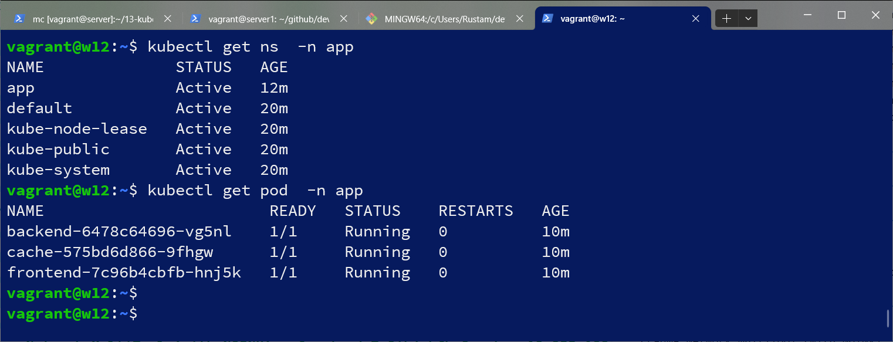
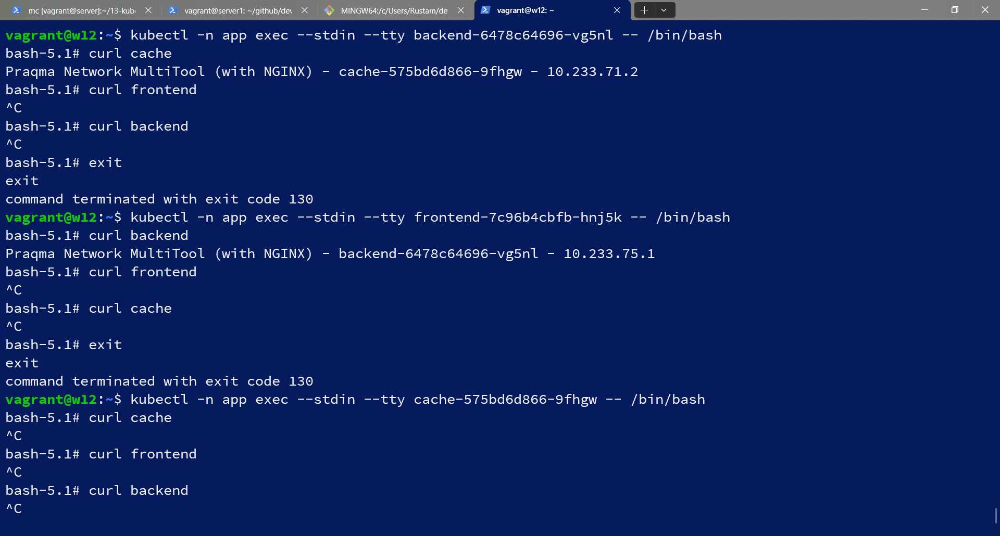

# Домашнее задание к занятию «Как работает сеть в K8s»

### Цель задания

Настроить сетевую политику доступа к подам.

### Чеклист готовности к домашнему заданию

1. Кластер K8s с установленным сетевым плагином Calico.

### Инструменты и дополнительные материалы, которые пригодятся для выполнения задания

1. [Документация Calico](https://www.tigera.io/project-calico/).
2. [Network Policy](https://kubernetes.io/docs/concepts/services-networking/network-policies/).
3. [About Network Policy](https://docs.projectcalico.org/about/about-network-policy).

-----

### Задание 1. Создать сетевую политику или несколько политик для обеспечения доступа

1. Создать deployment'ы приложений frontend, backend и cache и соответсвующие сервисы.
2. В качестве образа использовать network-multitool.
3. Разместить поды в namespace App.
4. Создать политики, чтобы обеспечить доступ frontend -> backend -> cache. Другие виды подключений должны быть запрещены.
5. Продемонстрировать, что трафик разрешён и запрещён.

#### Решение
fe.yaml:  
```
apiVersion: apps/v1
kind: Deployment
metadata:
  labels:
    app: frontend
  name: frontend
  namespace: app
spec:
  replicas: 1
  selector:
    matchLabels:
      app: frontend
  template:
    metadata:
      labels:
        app: frontend
    spec:
      containers:
        - image: praqma/network-multitool:alpine-extra
          imagePullPolicy: IfNotPresent
          name: network-multitool
      terminationGracePeriodSeconds: 30

---
apiVersion: v1
kind: Service
metadata:
  name: frontend
  namespace: app
spec:
  ports:
    - name: web
      port: 80
  selector:
    app: frontend
```
be.yaml:
```
piVersion: apps/v1
kind: Deployment
metadata:
  labels:
    app: backend
  name: backend
  namespace: app
spec:
  replicas: 1
  selector:
    matchLabels:
      app: backend
  template:
    metadata:
      labels:
        app: backend
    spec:
      containers:
        - image: praqma/network-multitool:alpine-extra
          imagePullPolicy: IfNotPresent
          name: network-multitool
      terminationGracePeriodSeconds: 30

---
apiVersion: v1
kind: Service
metadata:
  name: backend
  namespace: app
spec:
  ports:
    - name: web
      port: 80
  selector:
    app: backend
```
cache.yaml:
```
apiVersion: apps/v1
kind: Deployment
metadata:
  labels:
    app: cache
  name: cache
  namespace: app
spec:
  replicas: 1
  selector:
    matchLabels:
      app: cache
  template:
    metadata:
      labels:
        app: cache
    spec:
      containers:
        - image: praqma/network-multitool:alpine-extra
          imagePullPolicy: IfNotPresent
          name: network-multitool
      terminationGracePeriodSeconds: 30

---
apiVersion: v1
kind: Service
metadata:
  name: cache
  namespace: app
spec:
  ports:
    - name: web
      port: 80
  selector:
    app: cache
```
cоздал арр
```
vagrant@node1:~$ kubectl create namespace app
namespace/app created
vagrant@node1:~$ kubectl get namespace
NAME              STATUS   AGE
app               Active   19s
default           Active   41m
kube-node-lease   Active   41m
kube-public       Active   41m
kube-system       Active   41m
```
создал деплойменты и сервисы:
```
vagrant@node1:~$ kubectl apply -f fe.yaml
deployment.apps/frontend created
service/frontend created
vagrant@node1:~$ kubectl apply -f cache.yaml
deployment.apps/cache created
service/cache created
vagrant@node1:~$ kubectl apply -f be.yaml
deployment.apps/backend created
service/backend created
vagrant@node1:~$ kubectl get -n app deployments
NAME       READY   UP-TO-DATE   AVAILABLE   AGE
backend    1/1     1            1           2m57s
cache      1/1     1            1           3m53s
frontend   1/1     1            1           4m12s
vagrant@node1:~$ kubectl get svc -n app -o wide
NAME       TYPE        CLUSTER-IP      EXTERNAL-IP   PORT(S)   AGE     SELECTOR
backend    ClusterIP   10.233.51.58    <none>        80/TCP    4m11s   app=backend
cache      ClusterIP   10.233.12.74    <none>        80/TCP    5m8s    app=cache
frontend   ClusterIP   10.233.60.250   <none>        80/TCP    5m27s   app=frontend

```
проверил доступность приложений в сети:
```
vagrant@w12:~$ kubectl get pod  -n app
NAME                        READY   STATUS    RESTARTS   AGE
backend-6478c64696-vg5nl    1/1     Running   0          10m
cache-575bd6d866-9fhgw      1/1     Running   0          10m
frontend-7c96b4cbfb-hnj5k   1/1     Running   0          10m
vagrant@w12:~$
vagrant@w12:~$
vagrant@w12:~$
vagrant@w12:~$ kubectl -n app exec --stdin --tty cache-575bd6d866-9fhgw -- /bin/bash
bash-5.1# curl frontend
Praqma Network MultiTool (with NGINX) - frontend-7c96b4cbfb-hnj5k - 10.233.74.65
bash-5.1# curl backend
Praqma Network MultiTool (with NGINX) - backend-6478c64696-vg5nl - 10.233.75.1
bash-5.1# curl cache
Praqma Network MultiTool (with NGINX) - cache-575bd6d866-9fhgw - 10.233.71.2
bash-5.1# exit
exit
vagrant@w12:~$ kubectl -n app exec --stdin --tty frontend-7c96b4cbfb-hnj5k -- /bin/bash
bash-5.1# curl cache
Praqma Network MultiTool (with NGINX) - cache-575bd6d866-9fhgw - 10.233.71.2
bash-5.1# curl frontend
Praqma Network MultiTool (with NGINX) - frontend-7c96b4cbfb-hnj5k - 10.233.74.65
bash-5.1# curl backend
Praqma Network MultiTool (with NGINX) - backend-6478c64696-vg5nl - 10.233.75.1
bash-5.1# exit
exit
vagrant@w12:~$ kubectl -n app exec --stdin --tty backend-6478c64696-vg5nl -- /bin/bash
bash-5.1# curl backend
Praqma Network MultiTool (with NGINX) - backend-6478c64696-vg5nl - 10.233.75.1
bash-5.1# curl frontend
Praqma Network MultiTool (with NGINX) - frontend-7c96b4cbfb-hnj5k - 10.233.74.65
bash-5.1# curl cache
Praqma Network MultiTool (with NGINX) - cache-575bd6d866-9fhgw - 10.233.71.2
bash-5.1#
```
сетевые политики:
```
vagrant@w12:~$ cat np.yaml
apiVersion: networking.k8s.io/v1
kind: NetworkPolicy
metadata:
  name: default-deny-ingress
  namespace: app
spec:
  podSelector: {}
  policyTypes:
    - Ingress
vagrant@w12:~$ cat np-back.yaml
apiVersion: networking.k8s.io/v1
kind: NetworkPolicy
metadata:
  name: backend
  namespace: app
spec:
  podSelector:
    matchLabels:
      app: backend
  policyTypes:
    - Ingress
  ingress:
    - from:
      - podSelector:
          matchLabels:
            app: frontend
      ports:
        - protocol: TCP
          port: 80
vagrant@w12:~$ cat np-cache.yaml
apiVersion: networking.k8s.io/v1
kind: NetworkPolicy
metadata:
  name: cache
  namespace: app
spec:
  podSelector:
    matchLabels:
      app: cache
  policyTypes:
    - Ingress
  ingress:
    - from:
      - podSelector:
          matchLabels:
            app: backend
      ports:
        - protocol: TCP
          port: 80
```
применил сетевые политики:
```
vagrant@w12:~$ kubectl apply -f np.yaml
networkpolicy.networking.k8s.io/default-deny-ingress created
vagrant@w12:~$ kubectl apply -f np-back.yaml
networkpolicy.networking.k8s.io/backend created
vagrant@w12:~$ kubectl apply -f np-cache.yaml
networkpolicy.networking.k8s.io/cache created
vagrant@w12:~$ kubectl get networkpolicies -n app
NAME                   POD-SELECTOR   AGE
backend                app=backend    27s
cache                  app=cache      19s
default-deny-ingress   <none>         36s
```


### Правила приёма работы

1. Домашняя работа оформляется в своём Git-репозитории в файле README.md. Выполненное домашнее задание пришлите ссылкой на .md-файл в вашем репозитории.
2. Файл README.md должен содержать скриншоты вывода необходимых команд, а также скриншоты результатов.
3. Репозиторий должен содержать тексты манифестов или ссылки на них в файле README.md.