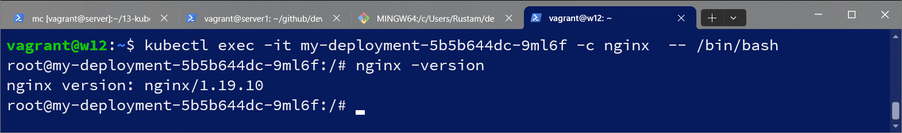

# Домашнее задание к занятию «Обновление приложений»

### Цель задания

Выбрать и настроить стратегию обновления приложения.

### Чеклист готовности к домашнему заданию

1. Кластер K8s.

### Инструменты и дополнительные материалы, которые пригодятся для выполнения задания

1. [Документация Updating a Deployment](https://kubernetes.io/docs/concepts/workloads/controllers/deployment/#updating-a-deployment).
2. [Статья про стратегии обновлений](https://habr.com/ru/companies/flant/articles/471620/).

-----

### Задание 1. Выбрать стратегию обновления приложения и описать ваш выбор

1. Имеется приложение, состоящее из нескольких реплик, которое требуется обновить.
2. Ресурсы, выделенные для приложения, ограничены, и нет возможности их увеличить.
3. Запас по ресурсам в менее загруженный момент времени составляет 20%.
4. Обновление мажорное, новые версии приложения не умеют работать со старыми.
5. Вам нужно объяснить свой выбор стратегии обновления приложения.

#### Решение
Учитывая что новые версии приложения не умеют работать со старыми, а также есть существенные ограничения в ресурсах, следует применить стратегию Recreate, старые поды удалятся а затем поднимутся новые. При этом будет перерыв в работе приложения - в условиях про это не сказано. 

### Задание 2. Обновить приложение

1. Создать deployment приложения с контейнерами nginx и multitool. Версию nginx взять 1.19. Количество реплик — 5.
2. Обновить версию nginx в приложении до версии 1.20, сократив время обновления до минимума. Приложение должно быть доступно.
3. Попытаться обновить nginx до версии 1.28, приложение должно оставаться доступным.
4. Откатиться после неудачного обновления.

#### Решение
деплоймент nginx 1.19:
```
apiVersion: apps/v1
kind: Deployment
metadata:
  name: my-deployment
  labels:
    app: nginx-1.19
spec:
  replicas: 5
  strategy:
    rollingUpdate:
      maxSurge: 100%
      maxUnavailable: 50%
  selector:
    matchLabels:
      app: nginx-1.19
  template:
    metadata:
      labels:
        app: nginx-1.19
    spec:
      containers:
      - name: nginx
        image: nginx:1.19
        ports:
        - containerPort: 80
      - name: multitool
        image: wbitt/network-multitool
        env:
          - name: HTTP_PORT
            value: "8080"
          - name: HTTPS_PORT
            value: "11443"
```
применил:
```
vagrant@w12:~$ kubectl get nodes
NAME    STATUS   ROLES           AGE   VERSION
node1   Ready    control-plane   38h   v1.29.2
node2   Ready    <none>          38h   v1.29.2
node3   Ready    <none>          38h   v1.29.2
node4   Ready    <none>          38h   v1.29.2
node5   Ready    <none>          38h   v1.29.2
vagrant@w12:~$ kubectl apply -f nginx119.yaml
deployment.apps/my-deployment created
vagrant@w12:~$ kubectl get deploy
NAME            READY   UP-TO-DATE   AVAILABLE   AGE
my-deployment   5/5     5            5           4m29s
vagrant@w12:~$ kubectl get pods
NAME                            READY   STATUS    RESTARTS   AGE
my-deployment-5b5b644dc-djxfs   2/2     Running   0          8s
my-deployment-5b5b644dc-drs24   2/2     Running   0          8s
my-deployment-5b5b644dc-v6npr   2/2     Running   0          8s
my-deployment-5b5b644dc-w57c5   2/2     Running   0          8s
my-deployment-5b5b644dc-wsd7q   2/2     Running   0          8s
```

поменял версию:
```
      - name: nginx
        image: nginx:1.20
```
применил, результат:
```
vagrant@w12:~$ kubectl apply -f nginx120.yaml
deployment.apps/my-deployment configured
vagrant@w12:~$ kubectl get pods
NAME                             READY   STATUS              RESTARTS   AGE
my-deployment-5b5b644dc-wsd7q    2/2     Terminating         0          69s
my-deployment-5fdd745df9-dt842   0/2     ContainerCreating   0          51s
my-deployment-5fdd745df9-g29gc   2/2     Running             0          51s
my-deployment-5fdd745df9-tql98   0/2     ContainerCreating   0          51s
my-deployment-5fdd745df9-txzdd   2/2     Running             0          51s
my-deployment-5fdd745df9-wkkd6   2/2     Running             0          51s
vagrant@w12:~$ kubectl get pods
NAME                             READY   STATUS    RESTARTS   AGE
my-deployment-5fdd745df9-dt842   2/2     Running   0          54s
my-deployment-5fdd745df9-g29gc   2/2     Running   0          54s
my-deployment-5fdd745df9-tql98   2/2     Running   0          54s
my-deployment-5fdd745df9-txzdd   2/2     Running   0          54s
my-deployment-5fdd745df9-wkkd6   2/2     Running   0          54s
```
проверил версию:  
```
vagrant@w12:~$ kubectl exec -it my-deployment-5fdd745df9-wkkd6 -c nginx  -- /bin/bash
```


поменял версию на 1.28:
```
      - name: nginx
        image: nginx:1.28
```
применил, результат:
```
vagrant@w12:~$ kubectl apply -f nginx128.yaml
deployment.apps/my-deployment configured
```

обновление не прошло, т.к. нет nginx 1.28.  

проверил версии деплоя:
```
vagrant@w12:~$ kubectl get rs
NAME                       DESIRED   CURRENT   READY   AGE
my-deployment-5b5b644dc    0         0         0       19m
my-deployment-5fdd745df9   3         3         3       19m
my-deployment-6c94b9c659   5         5         0       12m
vagrant@w12:~$ kubectl rollout history deployment/my-deployment
deployment.apps/my-deployment
REVISION  CHANGE-CAUSE
1         <none>
2         <none>
3         <none>
```
откатил на предыдущую версию:
```
vagrant@w12:~$ kubectl rollout undo deployment/my-deployment
deployment.apps/my-deployment rolled back
vagrant@w12:~$ kubectl get pods
NAME                             READY   STATUS    RESTARTS   AGE
my-deployment-5fdd745df9-g29gc   2/2     Running   0          23m
my-deployment-5fdd745df9-nxhg5   2/2     Running   0          5s
my-deployment-5fdd745df9-txzdd   2/2     Running   0          23m
my-deployment-5fdd745df9-wkkd6   2/2     Running   0          23m
my-deployment-5fdd745df9-x9nrw   2/2     Running   0          5s
```
проверил версии, появилась 4-я вместо 2-й:
```
vagrant@w12:~$ kubectl rollout history deployment/my-deployment
deployment.apps/my-deployment
REVISION  CHANGE-CAUSE
1         <none>
3         <none>
4         <none>
```

## Дополнительные задания — со звёздочкой*

Задания дополнительные, необязательные к выполнению, они не повлияют на получение зачёта по домашнему заданию. **Но мы настоятельно рекомендуем вам выполнять все задания со звёздочкой.** Это поможет лучше разобраться в материале.   

### Задание 3*. Создать Canary deployment

1. Создать два deployment'а приложения nginx.
2. При помощи разных ConfigMap сделать две версии приложения — веб-страницы.
3. С помощью ingress создать канареечный деплоймент, чтобы можно было часть трафика перебросить на разные версии приложения.

### Правила приёма работы

1. Домашняя работа оформляется в своем Git-репозитории в файле README.md. Выполненное домашнее задание пришлите ссылкой на .md-файл в вашем репозитории.
2. Файл README.md должен содержать скриншоты вывода необходимых команд, а также скриншоты результатов.
3. Репозиторий должен содержать тексты манифестов или ссылки на них в файле README.md.