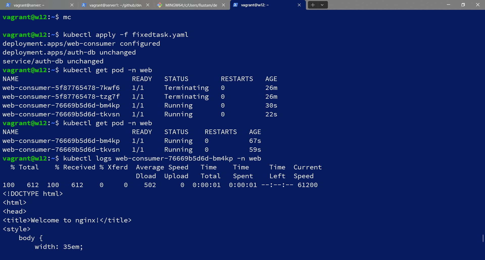

# Домашнее задание к занятию Troubleshooting

### Цель задания

Устранить неисправности при деплое приложения.

### Чеклист готовности к домашнему заданию

1. Кластер K8s.

### Задание. При деплое приложение web-consumer не может подключиться к auth-db. Необходимо это исправить

1. Установить приложение по команде:
```shell
kubectl apply -f https://raw.githubusercontent.com/netology-code/kuber-homeworks/main/3.5/files/task.yaml
```
2. Выявить проблему и описать.
3. Исправить проблему, описать, что сделано.
4. Продемонстрировать, что проблема решена.

#### Решение
запустил п.1
```
vagrant@w12:~$ kubectl apply -f https://raw.githubusercontent.com/netology-code/kuber-homeworks/main/3.5/files/task.yaml
Error from server (NotFound): error when creating "https://raw.githubusercontent.com/netology-code/kuber-homeworks/main/3.5/files/task.yaml": namespaces "web" not found
Error from server (NotFound): error when creating "https://raw.githubusercontent.com/netology-code/kuber-homeworks/main/3.5/files/task.yaml": namespaces "data" not found
Error from server (NotFound): error when creating "https://raw.githubusercontent.com/netology-code/kuber-homeworks/main/3.5/files/task.yaml": namespaces "data" not found
```
не определены неймспейсы, создаю и снова пытаюсь установить:
```
vagrant@w12:~$ kubectl create ns web
namespace/web created
vagrant@w12:~$ kubectl create ns data
namespace/data created
vagrant@w12:~$ kubectl apply -f https://raw.githubusercontent.com/netology-code/kuber-homeworks/main/3.5/files/task.yaml
deployment.apps/web-consumer created
deployment.apps/auth-db created
service/auth-db created
```
проверяю деплойменты, поды, сервисы, все ОК:
```
vagrant@w12:~$ kubectl get deploy -n web
NAME           READY   UP-TO-DATE   AVAILABLE   AGE
web-consumer   2/2     2            2           109s
vagrant@w12:~$ kubectl get deploy -n data
NAME      READY   UP-TO-DATE   AVAILABLE   AGE
auth-db   1/1     1            1           2m
vagrant@w12:~$ kubectl get pod -n data
NAME                       READY   STATUS    RESTARTS   AGE
auth-db-7b5cdbdc77-r2zl8   1/1     Running   0          2m19s
vagrant@w12:~$ kubectl get pod -n web
NAME                            READY   STATUS    RESTARTS   AGE
web-consumer-5f87765478-7kwf6   1/1     Running   0          2m27s
web-consumer-5f87765478-tzg7f   1/1     Running   0          2m27s
vagrant@w12:~$ kubectl get svc -n data
NAME      TYPE        CLUSTER-IP      EXTERNAL-IP   PORT(S)   AGE
auth-db   ClusterIP   10.233.33.127   <none>        80/TCP    2m43s

```
проверил логи:
```
vagrant@w12:~$ kubectl logs web-consumer-5f87765478-7kwf6 -n web
curl: (6) Couldn't resolve host 'auth-db'
....
vagrant@w12:~$ kubectl logs web-consumer-5f87765478-tzg7f -n web
curl: (6) Couldn't resolve host 'auth-db'
```
приложение не может разрешить имя auth-db похоже на проблему с DNS, проверил доступность из пода:
```
vagrant@w12:~$ kubectl get svc -n data
NAME      TYPE        CLUSTER-IP      EXTERNAL-IP   PORT(S)   AGE
auth-db   ClusterIP   10.233.33.127   <none>        80/TCP    12m
vagrant@w12:~$ kubectl exec -n web -it web-consumer-5f87765478-tzg7f -- /bin/sh
/bin/sh: shopt: not found
[ root@web-consumer-5f87765478-tzg7f:/ ]$ curl auth-db
curl: (6) Couldn't resolve host 'auth-db'
[ root@web-consumer-5f87765478-tzg7f:/ ]$ curl 10.233.33.127
<!DOCTYPE html>
<html>
<head>
<title>Welcome to nginx!</title>
<style>
    body {
        width: 35em;
        margin: 0 auto;
        font-family: Tahoma, Verdana, Arial, sans-serif;
    }
</style>
</head>
<body>
<h1>Welcome to nginx!</h1>
<p>If you see this page, the nginx web server is successfully installed and
working. Further configuration is required.</p>

<p>For online documentation and support please refer to
<a href="http://nginx.org/">nginx.org</a>.<br/>
Commercial support is available at
<a href="http://nginx.com/">nginx.com</a>.</p>

<p><em>Thank you for using nginx.</em></p>
</body>
</html>
```
все подтверждается по айпи адресу все находится по имени нет варианты решения:
  - разные неймспейсы надо fqdn использовать,
  - либо DNS поднимать, 
  - либо в hosts прописывать,
  - либо использовать прямой IP адрес
правильнее использовать первый способ:
скачиваю к себе файл
```
vagrant@w12:~$ wget https://raw.githubusercontent.com/netology-code/kuber-homeworks/main/3.5/files/task.yaml -O fixedtask.yaml
```
исправил строчку:
```
- while true; do curl auth-db; sleep 5; done
```
на
```
- while true; do curl auth-db.data; sleep 5; done
```
полный текст:
```
apiVersion: apps/v1
kind: Deployment
metadata:
  name: web-consumer
  namespace: web
spec:
  replicas: 2
  selector:
    matchLabels:
      app: web-consumer
  template:
    metadata:
      labels:
        app: web-consumer
    spec:
      containers:
      - command:
        - sh
        - -c
        - while true; do curl auth-db.data; sleep 5; done
        image: radial/busyboxplus:curl
        name: busybox
---
apiVersion: apps/v1
kind: Deployment
metadata:
  name: auth-db
  namespace: data
spec:
  replicas: 1
  selector:
    matchLabels:
      app: auth-db
  template:
    metadata:
      labels:
        app: auth-db
    spec:
      containers:
      - image: nginx:1.19.1
        name: nginx
        ports:
        - containerPort: 80
          protocol: TCP
---
apiVersion: v1
kind: Service
metadata:
  name: auth-db
  namespace: data
spec:
  ports:
  - port: 80
    protocol: TCP
    targetPort: 80
  selector:
    app: auth-db
```
установил, все заработало:

### Правила приёма работы

1. Домашняя работа оформляется в своём Git-репозитории в файле README.md. Выполненное домашнее задание пришлите ссылкой на .md-файл в вашем репозитории.
2. Файл README.md должен содержать скриншоты вывода необходимых команд, а также скриншоты результатов.
3. Репозиторий должен содержать тексты манифестов или ссылки на них в файле README.md.