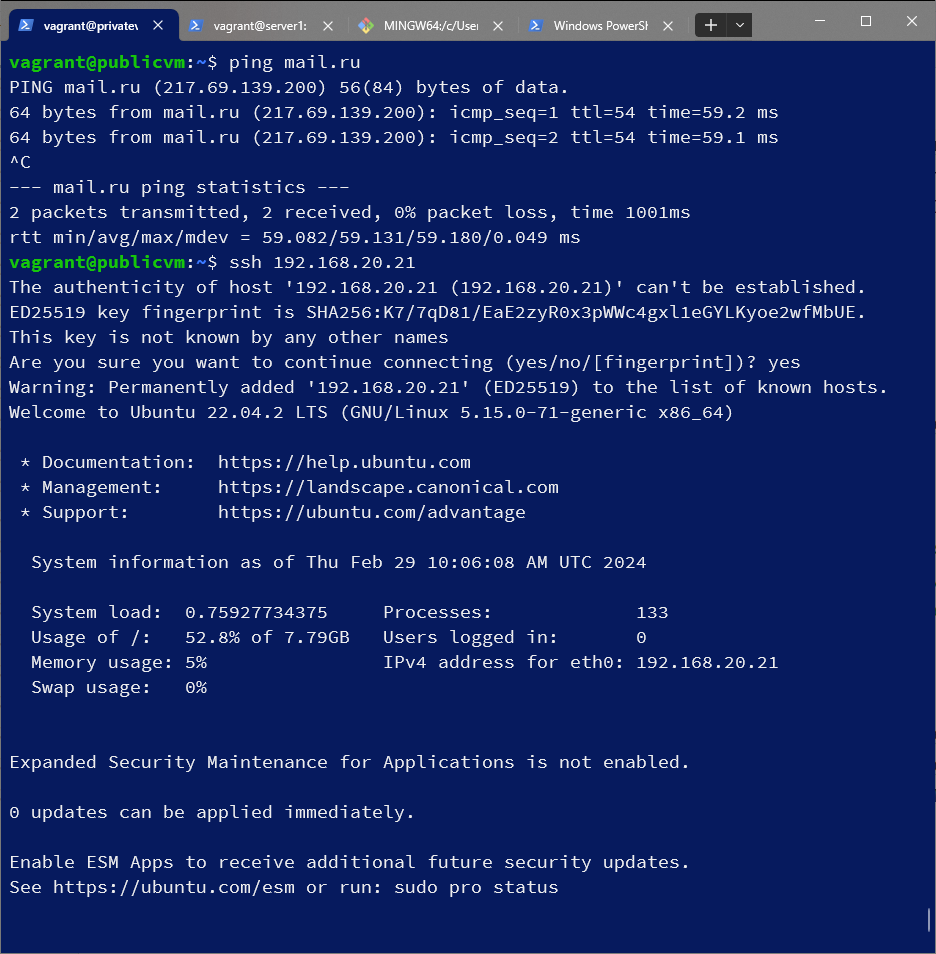
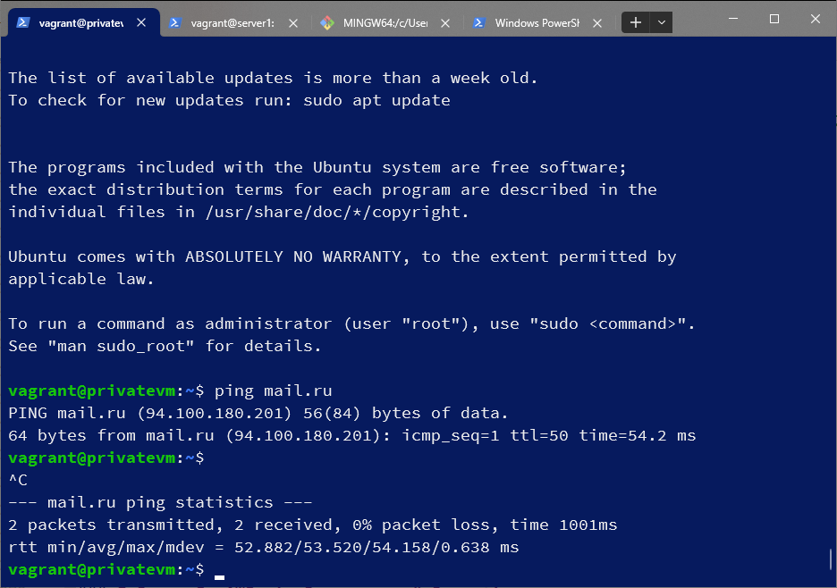

# Домашнее задание к занятию «Организация сети»

### Подготовка к выполнению задания

1. Домашнее задание состоит из обязательной части, которую нужно выполнить на провайдере Yandex Cloud, и дополнительной части в AWS (выполняется по желанию). 
2. Все домашние задания в блоке 15 связаны друг с другом и в конце представляют пример законченной инфраструктуры.  
3. Все задания нужно выполнить с помощью Terraform. Результатом выполненного домашнего задания будет код в репозитории. 
4. Перед началом работы настройте доступ к облачным ресурсам из Terraform, используя материалы прошлых лекций и домашнее задание по теме «Облачные провайдеры и синтаксис Terraform». Заранее выберите регион (в случае AWS) и зону.

---
### Задание 1. Yandex Cloud 

**Что нужно сделать**

1. Создать пустую VPC. Выбрать зону.
2. Публичная подсеть.

 - Создать в VPC subnet с названием public, сетью 192.168.10.0/24.
 - Создать в этой подсети NAT-инстанс, присвоив ему адрес 192.168.10.254. В качестве image_id использовать fd80mrhj8fl2oe87o4e1.
 - Создать в этой публичной подсети виртуалку с публичным IP, подключиться к ней и убедиться, что есть доступ к интернету.
3. Приватная подсеть.
 - Создать в VPC subnet с названием private, сетью 192.168.20.0/24.
 - Создать route table. Добавить статический маршрут, направляющий весь исходящий трафик private сети в NAT-инстанс.
 - Создать в этой приватной подсети виртуалку с внутренним IP, подключиться к ней через виртуалку, созданную ранее, и убедиться, что есть доступ к интернету.

Resource Terraform для Yandex Cloud:

- [VPC subnet](https://registry.terraform.io/providers/yandex-cloud/yandex/latest/docs/resources/vpc_subnet).
- [Route table](https://registry.terraform.io/providers/yandex-cloud/yandex/latest/docs/resources/vpc_route_table).
- [Compute Instance](https://registry.terraform.io/providers/yandex-cloud/yandex/latest/docs/resources/compute_instance).

#### Решение
провайдер и версия versions.tf:
```
terraform {
 required_providers {
   yandex = {
     source  = "yandex-cloud/yandex"
   }
 }
 required_version = ">= 0.13"
}
```
основная конфигурация main.tf комментарии по тексту:
```
provider "yandex" {
  cloud_id  = "b1grn553i4jliur438sh"
  folder_id = "b1gr8f0k0vi2jeh5clg6"
  zone      = "ru-central1-a"
}

# Создал пустую VPC
resource "yandex_vpc_network" "net1" {
  name = "network-1"
}

# Создал в VPC subnet с названием public, сетью 192.168.10.0/24, выбрал зону
resource "yandex_vpc_subnet" "sub1" {
  name = "public"
  zone           = "ru-central1-a"
  network_id     = "${yandex_vpc_network.net1.id}"
  v4_cidr_blocks = ["192.168.10.0/24"]
}
# Создать в этой подсети NAT-инстанс, присвоив ему адрес 192.168.10.254. В качестве image_id использовать fd80mrhj8fl>resource "yandex_compute_image" "img" {
  name       = "img"
  source_image = "fd80mrhj8fl2oe87o4e1"
}

resource "yandex_compute_instance" "nat" {
  name = "nat-instance"
  hostname = "nat"
  resources {
    cores  = 2
    memory = 4
  }
  network_interface {
    subnet_id = "${yandex_vpc_subnet.sub1.id}"
    nat = true
    ip_address = "192.168.10.254"
  }
  boot_disk {
    initialize_params {
      image_id = "${yandex_compute_image.img.id}"
    }
  }
# указал ранее сгенерированный публичный ключ чтобы можно было подключиться
  metadata = {
    user-data = "${file("~/14-clopro-hw-15.1/terraform/meta.txt")}"
  }
}
# Создать в этой публичной подсети виртуалку с публичным IP, подключиться к ней и убедиться, что есть доступ к интерн>resource "yandex_compute_image" "imgubuntu" {
  name       = "ubuntu"
#Ubuntu-2204-lts
  source_image = "fd8r9ntkrnrn46fkh0e4"
}

resource "yandex_compute_instance" "vm1" {
  name = "publicvm"
  hostname = "publicvm"
  resources {
    cores  = 2
    memory = 4
  }
  network_interface {
    subnet_id = "${yandex_vpc_subnet.sub1.id}"
    nat = true
  }
  boot_disk {
    initialize_params {
      image_id = "${yandex_compute_image.imgubuntu.id}"
    }
  }
    metadata = {
    user-data = "${file("~/14-clopro-hw-15.1/terraform/meta.txt")}"
  }
# копируем приватный ключ на ВМ, чтобы потом можно было с нее подключаться
  provisioner "file" {
    source      = pathexpand("~/.ssh/id_rsa")
    destination = pathexpand("~/.ssh/id_rsa")
    connection {
      type        = "ssh"
      host        = self.network_interface.0.nat_ip_address
      user        = "vagrant"
      private_key = "${file("~/.ssh/id_rsa")}"
    }
  }
  provisioner "remote-exec" {
    inline = [
      "chmod 600 ~/.ssh/id_rsa",
    ]
    connection {
      type        = "ssh"
      host        = self.network_interface.0.nat_ip_address
      user        = "vagrant"
      private_key = "${file("~/.ssh/id_rsa")}"
    }
  }
} 
# Создать в VPC subnet с названием private, сетью 192.168.20.0/24
resource "yandex_vpc_subnet" "sub2" {
  name           = "private"
  v4_cidr_blocks = ["192.168.20.0/24"]
  zone           = "ru-central1-a"
  network_id     = "${yandex_vpc_network.net1.id}"
  route_table_id = yandex_vpc_route_table.rt.id
}

# Создать route table. Добавить статический маршрут, направляющий весь исходящий трафик private сети в NAT-инстанс
resource "yandex_vpc_route_table" "rt" {
  name       = "routing"
  network_id = "${yandex_vpc_network.net1.id}"

  static_route {
    destination_prefix = "0.0.0.0/0"
    next_hop_address   = "192.168.10.254"
  }
}
# Создать в этой приватной подсети виртуалку с внутренним IP, подключиться к ней через виртуалку, созданную ранее, и >resource "yandex_compute_instance" "vm2" {
  name = "privatevm"
  hostname = "privatevm"
  resources {
    cores  = 2
    memory = 4
  }
  network_interface {
    subnet_id = "${yandex_vpc_subnet.sub2.id}"
    nat = false
  }
  boot_disk {
    initialize_params {
      image_id = "${yandex_compute_image.imgubuntu.id}"
    }
  }
  metadata = {
    user-data = "${file("~/14-clopro-hw-15.1/terraform/meta.txt")}"
  }
}
# вывод адресов
output "NAT_external_ip_address" {
  value = yandex_compute_instance.nat.network_interface.0.nat_ip_address
}

output "NAT_internal_ip_address" {
  value = yandex_compute_instance.nat.network_interface.0.ip_address
}

output "Public_VM_external_ip_address" {
  value = yandex_compute_instance.vm1.network_interface.0.nat_ip_address
}

output "Public_VM_internal_ip_address" {
  value = yandex_compute_instance.vm1.network_interface.0.ip_address
}

output "Private_VM_internal_ip_address" {
  value = yandex_compute_instance.vm2.network_interface.0.ip_address
}

```
meta.txt:
```
#cloud-config
users:
  - name: vagrant
    groups: sudo
    shell: /bin/bash
    sudo: ['ALL=(ALL) NOPASSWD:ALL']
    ssh_authorized_keys:
      - ssh-rsa AAAAB3NzaC1yc2EAAAADAQABAAABgQCoxR0qNIKTxA7TdttPpG+UavJx09TTBk2ek8agOWXihYIHdoCgYpjRp0cuWgHwfqit8mhuXOItSxTYFlr3miEm7>      - ssh-rsa AAAAB3NzaC1yc2EAAAADAQABAAABgQDYWysX4GZ+lBh5wXyFc6oNdwXtyOdvmrc3dUubbtzdTRPvs0D4ebvE5Ljgw0Qz1yqUwRLPSicVrAAL7N7HL/MPP>
```
запуск, результат:
```
vagrant@server:~/14-clopro-hw-15.1/terraform$ terraform apply
............

yandex_compute_image.img: Creating...
yandex_vpc_network.net1: Creating...
yandex_compute_image.imgubuntu: Creating...
yandex_vpc_network.net1: Creation complete after 3s [id=enp4gm35j3d61ms8p19r]
yandex_vpc_route_table.rt: Creating...
yandex_vpc_subnet.sub1: Creating...
yandex_vpc_route_table.rt: Creation complete after 1s [id=enpbu08jrrqb99mne1dp]
yandex_vpc_subnet.sub2: Creating...
yandex_vpc_subnet.sub2: Creation complete after 0s [id=e9bb9jtcv8fapbfadbu8]
yandex_vpc_subnet.sub1: Creation complete after 2s [id=e9ba99vp154bi4lcfp0u]
yandex_compute_image.img: Still creating... [15s elapsed]
yandex_compute_image.imgubuntu: Still creating... [15s elapsed]
yandex_compute_image.imgubuntu: Creation complete after 15s [id=fd8uoaf741vfoji9ruiq]
yandex_compute_instance.vm1: Creating...
yandex_compute_instance.vm2: Creating...
yandex_compute_image.img: Creation complete after 20s [id=fd83s6sgc77dbd3290t4]
yandex_compute_instance.nat: Creating...
yandex_compute_instance.vm1: Still creating... [10s elapsed]
yandex_compute_instance.vm2: Still creating... [10s elapsed]
yandex_compute_instance.nat: Still creating... [10s elapsed]
yandex_compute_instance.vm2: Still creating... [20s elapsed]
yandex_compute_instance.vm1: Still creating... [20s elapsed]
yandex_compute_instance.vm2: Still creating... [1m46s elapsed]
yandex_compute_instance.vm1: Still creating... [1m46s elapsed]
yandex_compute_instance.nat: Still creating... [1m41s elapsed]
yandex_compute_instance.vm1: Provisioning with 'file'...
yandex_compute_instance.vm2: Creation complete after 1m46s [id=fhmf5nank2sbqlt7cp4c]
yandex_compute_instance.nat: Still creating... [1m51s elapsed]
yandex_compute_instance.vm1: Still creating... [1m56s elapsed]
yandex_compute_instance.nat: Creation complete after 2m0s [id=fhmj9dt8lnqgp0qb32ft]
yandex_compute_instance.vm1: Still creating... [2m6s elapsed]
yandex_compute_instance.vm1: Still creating... [4m5s elapsed]
yandex_compute_instance.vm1: Still creating... [4m15s elapsed]
yandex_compute_instance.vm1: Still creating... [4m26s elapsed]
yandex_compute_instance.vm1: Provisioning with 'remote-exec'...
yandex_compute_instance.vm1 (remote-exec): Connecting to remote host via SSH...
yandex_compute_instance.vm1 (remote-exec):   Host: 158.160.124.235
yandex_compute_instance.vm1 (remote-exec):   User: vagrant
yandex_compute_instance.vm1 (remote-exec):   Password: false
yandex_compute_instance.vm1 (remote-exec):   Private key: true
yandex_compute_instance.vm1 (remote-exec):   Certificate: false
yandex_compute_instance.vm1 (remote-exec):   SSH Agent: false
yandex_compute_instance.vm1 (remote-exec):   Checking Host Key: false
yandex_compute_instance.vm1 (remote-exec):   Target Platform: unix
yandex_compute_instance.vm1 (remote-exec): Connected!
yandex_compute_instance.vm1: Creation complete after 4m28s [id=fhmo6aaakn8l493thehu]

Apply complete! Resources: 9 added, 0 changed, 0 destroyed.

Outputs:

NAT_external_ip_address = "158.160.97.148"
NAT_internal_ip_address = "192.168.10.254"
Private_VM_internal_ip_address = "192.168.20.21"
Public_VM_external_ip_address = "158.160.124.235"
Public_VM_internal_ip_address = "192.168.10.30"
```
проверка доступности интернет из публичной виртуальной машины и подключение к приватной вирт.машине

проверка доступности интернет из приватной виртуальной машины

---
### Задание 2. AWS* (задание со звёздочкой)

Это необязательное задание. Его выполнение не влияет на получение зачёта по домашней работе.

**Что нужно сделать**

1. Создать пустую VPC с подсетью 10.10.0.0/16.
2. Публичная подсеть.

 - Создать в VPC subnet с названием public, сетью 10.10.1.0/24.
 - Разрешить в этой subnet присвоение public IP по-умолчанию.
 - Создать Internet gateway.
 - Добавить в таблицу маршрутизации маршрут, направляющий весь исходящий трафик в Internet gateway.
 - Создать security group с разрешающими правилами на SSH и ICMP. Привязать эту security group на все, создаваемые в этом ДЗ, виртуалки.
 - Создать в этой подсети виртуалку и убедиться, что инстанс имеет публичный IP. Подключиться к ней, убедиться, что есть доступ к интернету.
 - Добавить NAT gateway в public subnet.
3. Приватная подсеть.
 - Создать в VPC subnet с названием private, сетью 10.10.2.0/24.
 - Создать отдельную таблицу маршрутизации и привязать её к private подсети.
 - Добавить Route, направляющий весь исходящий трафик private сети в NAT.
 - Создать виртуалку в приватной сети.
 - Подключиться к ней по SSH по приватному IP через виртуалку, созданную ранее в публичной подсети, и убедиться, что с виртуалки есть выход в интернет.

Resource Terraform:

1. [VPC](https://registry.terraform.io/providers/hashicorp/aws/latest/docs/resources/vpc).
1. [Subnet](https://registry.terraform.io/providers/hashicorp/aws/latest/docs/resources/subnet).
1. [Internet Gateway](https://registry.terraform.io/providers/hashicorp/aws/latest/docs/resources/internet_gateway).

### Правила приёма работы

Домашняя работа оформляется в своём Git репозитории в файле README.md. Выполненное домашнее задание пришлите ссылкой на .md-файл в вашем репозитории.
Файл README.md должен содержать скриншоты вывода необходимых команд, а также скриншоты результатов.
Репозиторий должен содержать тексты манифестов или ссылки на них в файле README.md.