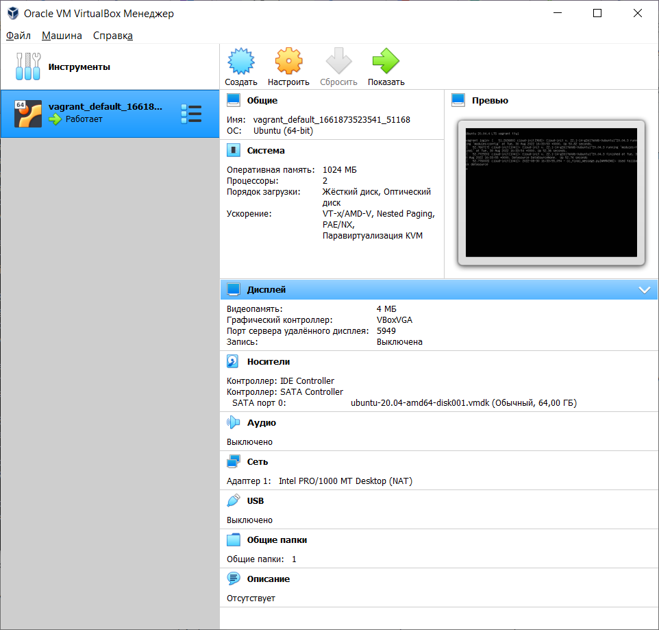

#devops-netology
5.

6. 
config.vm.provider "virtualbox" do |v|
  v.memory = 1024
  v.cpus = 2
end
8. 
HISTSIZE, 862 line   
ignoreboth is shorthand for ignorespace & ignoredups  
9. Brace Expansion, 921 line    
10.  touch file{1..100000}     
300000 не создается -bash: /usr/bin/touch: Argument list too long  
Ограничение системы
11. вернет true, 0, т.к. /tmp существует   
12. 
mkdir /tmp/new_path_directory  
cp /bin/bash /tmp/new_path_directory/  
echo $PATH  
export PATH=/tmp/new_path_directory:/usr/local/sbin:/usr/local/bin:/usr/sbin:/usr/bin:/sbin:/bin:/usr/games:/usr/loc
al/games:/snap/bin  
type -a bash   
vagrant@vagrant:~$ type -a bash  
bash is /tmp/new_path_directory/bash  
bash is /usr/bin/bash  
bash is /bin/bash  

13. at выполняется в определенное время batch когда позволяет загрузка системы  
14. vagrant halt  

